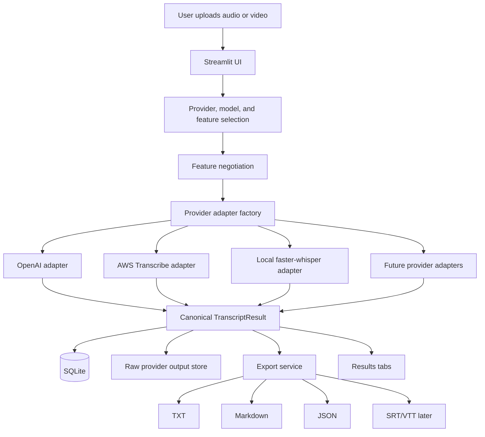
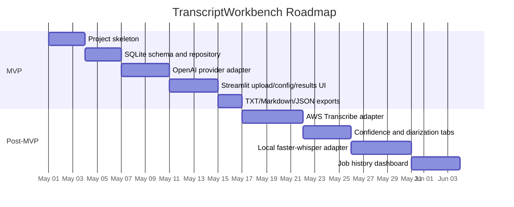

# TranscriptWorkbench

**TranscriptWorkbench** is a planned local-first, provider-agnostic transcription utility for turning common audio and video files into readable transcripts, structured transcript data, and later confidence-aware analysis.

The project is designed for people who frequently need to transcribe podcasts, web audio, phone recordings, interviews, lectures, meetings, voice memos, or video files with audio. The first version is intentionally practical: upload a file, choose a provider, choose optional features, run transcription, review the result, and export useful files.

> **Current status:** the MVP is implemented. The app runs locally via Streamlit, uses SQLite for persistence, fully implements the OpenAI provider, and includes registry stubs for AWS Transcribe and faster-whisper for the next milestones. See `UAT_CHECKLIST.md` for a step-by-step user-acceptance test plan.

---

## Why this project exists

There are many transcription APIs and open-source speech-to-text tools, but they differ in cost, accuracy, diarization support, confidence metadata, deployment complexity, and privacy posture.

TranscriptWorkbench treats those differences as provider-specific details behind a stable user experience and a stable internal data model.

The core idea is simple:

- The **user** asks for capabilities: timestamps, confidence, diarization, exports.
- The **app** checks which selected provider/model can actually support those capabilities.
- The **provider adapter** handles the messy provider-specific API behavior.
- The **canonical transcript schema** keeps results comparable across providers.

That makes it possible to start with one easy backend, then add AWS, local Whisper, AssemblyAI, Deepgram, or other providers later without redesigning the whole app.

---

## MVP goals

The MVP should provide a useful local utility with enough structure to grow into a more capable transcription workbench.

### MVP includes

- Local Streamlit interface
- Audio or video upload
- OpenAI transcription backend
- Provider and model selection
- Feature checkboxes
- Capability feedback panel
- SQLite persistence
- Raw provider response storage
- Transcript results displayed in tabs
- TXT, Markdown, and JSON exports
- Job history foundation

### MVP does not need to include yet

- AWS Transcribe integration
- Local faster-whisper backend
- Real-time transcription
- Multi-user authentication
- Full transcript editor
- Vector search over transcripts
- LLM summarization pipeline
- Production deployment

Those are intentionally post-MVP extensions.

---

## Intended user experience

A user should be able to:

1. Upload a common audio or video file.
2. Choose a transcription provider and model.
3. Request optional features such as timestamps, confidence information, or diarization.
4. See whether the selected provider/model supports those features.
5. Run transcription.
6. Review the transcript in progressive-disclosure tabs.
7. Download TXT, Markdown, JSON, and later caption files.
8. Revisit previous transcription jobs.
9. Add more providers later without changing the core workflow.

---

## High-level architecture



The most important design rule is that `app.py` should stay thin. Provider-specific API calls, parsing, SQL, feature negotiation, and export formatting should live in dedicated modules.

---

## Core design principles

### 1. Local-first

The first version should run locally through Streamlit. This keeps the development loop fast and avoids deployment complexity while proving the app is genuinely useful.

### 2. Provider-agnostic

The app should not be designed around one transcription provider. Each provider gets an adapter that returns the same canonical result shape.

### 3. Capability-driven UI

The user should choose what they want, not memorize which provider supports which feature.

For example, the user checks:

- Include timestamps
- Include confidence information
- Identify speakers

Then the app explains what the selected provider/model can actually do.

### 4. SQLite early

SQLite should be used early for job metadata, provider runs, segments, words, artifacts, warnings, and errors. This gives the project a clean path toward job history, dashboards, and provider comparison.

### 5. Preserve raw outputs

Every raw provider response should be saved unchanged. This supports debugging, future re-parsing, provider comparison, and reproducibility.

### 6. Diarization-ready from day one

Speaker diarization does not need to be perfect in the MVP, but the data model should include nullable speaker fields immediately. That prevents a disruptive schema redesign later.

---

## Provider strategy

The first useful version should start with OpenAI because it is the fastest path to a working transcription utility. The next major provider should be AWS Transcribe because it is a strong fit for confidence scores and diarization.

| Provider | MVP status | Best use | Notes |
|---|---:|---|---|
| OpenAI | First backend | Easy, high-quality transcription | Good default path for proving the app |
| AWS Transcribe | Near-term extension | Confidence scores and diarization | Best first serious metadata backend |
| Local faster-whisper | Near-term extension | Local/open-source transcription | Useful for privacy, cost control, and benchmarking |
| AssemblyAI | Later | Managed confidence and diarization | Good ergonomic managed API candidate |
| Deepgram | Later | Fast transcription, streaming, diarization | Strong if real-time workflows become important |
| Google Speech-to-Text | Later | Cloud ASR benchmarking | Optional comparison provider |
| Azure AI Speech | Later | Azure learning/certification alignment | Optional comparison provider |

---

## Capability negotiation model

Different providers support different capabilities. TranscriptWorkbench should represent capability support explicitly.

| Status | Meaning |
|---|---|
| `supported` | Directly supported by the selected provider/model |
| `partial` | Supported, but with caveats |
| `proxy` | Available only as an approximate signal |
| `diagnostic` | Available as model diagnostic information, not calibrated confidence |
| `unsupported` | Not available |
| `not_requested` | User did not request this feature |

Example:

```json
{
  "requested_features": {
    "timestamps": true,
    "confidence": true,
    "diarization": false,
    "save_raw": true
  },
  "effective_features": {
    "timestamps": "partial",
    "confidence": "proxy",
    "diarization": "not_requested",
    "save_raw": "supported"
  }
}
```

This prevents a common transcription-app failure mode: pretending all providers return equivalent outputs when they do not.

---

## Canonical transcript shape

All providers should eventually map into a shared internal schema.

```json
{
  "job_id": "uuid",
  "provider": "openai",
  "model": "gpt-4o-mini-transcribe",
  "language": "en",
  "duration_seconds": 3600,
  "text": "Full transcript text goes here.",
  "segments": [
    {
      "segment_id": 1,
      "start": 0.0,
      "end": 12.4,
      "speaker": null,
      "text": "This is the first transcript segment.",
      "confidence": null,
      "confidence_type": null
    }
  ],
  "words": [],
  "warnings": [],
  "artifacts": {
    "txt": "outputs/job-id/transcript.txt",
    "md": "outputs/job-id/transcript.md",
    "json": "outputs/job-id/transcript.json",
    "raw": "outputs/job-id/raw_response.json"
  }
}
```

The schema should allow partial data. For example, an OpenAI run may produce a strong transcript but no calibrated word-level confidence. AWS may produce word-level confidence and speaker labels. A local Whisper run may produce useful segment diagnostics but not true confidence scores.

---

## Planned repository structure

The actual repository structure:

```text
baba-transcription-utility/         # local checkout name; GitHub remote is `baba-transcription-service`
  app.py
  README.md
  .env.example
  .gitignore
  requirements.txt

  docs/
    REQUIREMENTS.md
    IMPLEMENTATION_PLAN.md
    USER_GUIDE.md
    UAT_CHECKLIST.md
    AWS_TRANSCRIBE_SETUP.md
    DEPLOYMENT.md

  transcript_workbench/
    config.py
    constants.py

    db/
      connection.py
      schema.sql
      repository.py

    models/
      canonical.py
      features.py

    providers/
      base.py
      factory.py
      registry.py
      pricing.py           ← cost estimation (duration × published rate per provider/model)
      openai_provider.py
      aws_provider.py
      faster_whisper_provider.py

    services/
      audio.py
      files.py
      feature_negotiation.py
      transcription.py
      exports.py
      confidence.py

    ui/
      upload.py
      configuration.py
      results.py
      history.py

    utils/
      ids.py
      hashing.py
      time.py
      logging.py

  tests/
    test_feature_negotiation.py
    test_exports.py
    test_sqlite_repository.py
    test_openai_parser.py
    test_pricing.py
    fixtures/
      sample_openai_verbose_response.json
      sample_openai_simple_response.json

  data/
    .gitkeep
```

---

## Local development quick start

```bash
python -m venv .venv
source .venv/bin/activate
pip install -r requirements.txt
cp .env.example .env
# add OPENAI_API_KEY to .env
streamlit run app.py

# tests
python -m pytest tests/
```

You may also need `ffmpeg` for audio metadata inspection, conversion, and normalization.

On macOS:

```bash
brew install ffmpeg
```

On Ubuntu:

```bash
sudo apt update
sudo apt install ffmpeg
```

---

## Environment variables

The MVP should require only an OpenAI key. Other provider keys should be optional until those providers are implemented.

```bash
OPENAI_API_KEY=

AWS_ACCESS_KEY_ID=
AWS_SECRET_ACCESS_KEY=
AWS_DEFAULT_REGION=us-east-1
AWS_TRANSCRIBE_BUCKET=

ASSEMBLYAI_API_KEY=
DEEPGRAM_API_KEY=

TRANSCRIPT_WORKBENCH_DATA_DIR=./data
MAX_UPLOAD_MB=200
LOW_CONFIDENCE_THRESHOLD=0.80
```

For an eventual deployed bring-your-own-token version, provider tokens should not be hardcoded into the app. A user should be able to provide their own token through environment variables or a secure session-level input mechanism.

---

## Result tabs

The Streamlit app should use tabs for progressive disclosure.

Recommended MVP tabs:

1. **Transcript** — readable full transcript
2. **Segments** — timestamped segments when available
3. **Metadata** — provider, model, duration, file info, feature support
4. **Downloads** — TXT, Markdown, JSON, raw provider output
5. **History** — previous jobs, if implemented in the first SQLite pass

Recommended post-MVP tabs:

1. **Speakers** — diarized speaker view
2. **Confidence** — confidence summary and low-confidence sections
3. **Provider comparison** — runtime, cost, confidence, and output comparison across providers
4. **Analysis** — summaries, topics, entities, reusable quotes, and later knowledge extraction

---

## Roadmap



The dates above are placeholders for sequencing. They are not a commitment to a calendar schedule.

---

## Documentation map

| Document | Purpose |
|---|---|
| [`docs/REQUIREMENTS.md`](docs/REQUIREMENTS.md) | Functional and non-functional requirements for the MVP and near-term roadmap |
| [`docs/IMPLEMENTATION_PLAN.md`](docs/IMPLEMENTATION_PLAN.md) | Technical architecture, module structure, schemas, service boundaries, and implementation milestones |
| [`docs/USER_GUIDE.md`](docs/USER_GUIDE.md) | User-facing instructions for running and using the app locally and on EC2 |
| [`docs/UAT_CHECKLIST.md`](docs/UAT_CHECKLIST.md) | Step-by-step user acceptance test plan for the MVP |
| [`docs/AWS_TRANSCRIBE_SETUP.md`](docs/AWS_TRANSCRIBE_SETUP.md) | AWS IAM, S3, and Transcribe setup for the post-MVP provider |
| [`docs/DEPLOYMENT.md`](docs/DEPLOYMENT.md) | EC2 deployment guide including custom domain and HTTPS |

Start with `REQUIREMENTS.md` to understand what the app must do. Use `IMPLEMENTATION_PLAN.md` when building. Use `USER_GUIDE.md` for the end-user experience. Use `DEPLOYMENT.md` for EC2 setup.

---

## Suggested implementation milestones

### Milestone 1: Skeleton

- Create repository structure
- Add `.env.example`
- Add provider registry placeholder
- Add Pydantic models or dataclasses
- Add Streamlit shell with tabs

### Milestone 2: Persistence

- Add SQLite schema
- Add repository functions
- Create job directory structure
- Store uploaded file metadata

### Milestone 3: OpenAI transcription

- Implement OpenAI provider adapter
- Save raw response
- Map provider response to canonical schema
- Display transcript
- Export TXT, Markdown, and JSON

### Milestone 4: Feature negotiation

- Add capability matrix
- Add requested vs effective features
- Add UI warnings for unsupported or partial features

### Milestone 5: AWS Transcribe

- Add S3 upload
- Start and poll transcription jobs
- Parse confidence and diarization output
- Add Confidence and Speaker tabs

### Milestone 6: Local open-source transcription

- Add faster-whisper adapter
- Add local model configuration
- Add clear confidence caveats

---

## Testing strategy

The project should include tests for the parts most likely to break or become provider-specific.

Recommended early tests:

- Feature negotiation logic
- Provider registry behavior
- SQLite repository create/read functions
- Export formatting
- OpenAI response parsing
- AWS response parsing once AWS is added
- Edge cases for missing timestamps, missing confidence, and missing speaker labels

The app should also include a small set of fixture JSON responses so parsing can be tested without calling external APIs.

---

## Open-source posture

The project should be safe to open source as a bring-your-own-token utility.

Recommended practices:

- Never commit `.env`
- Never commit uploaded audio
- Never commit raw provider outputs from real user files
- Include `.env.example`
- Include `data/.gitkeep`, but ignore actual data contents
- Make provider keys optional unless the provider is selected
- Clearly label implemented vs planned providers
- Keep provider-specific SDKs optional where possible

---

## Naming note

The working title is **TranscriptWorkbench**. It is intentionally descriptive rather than precious. If the project later becomes more polished, possible names could emphasize transcription, sensemaking, or audio-to-knowledge workflows. For the MVP, clarity wins.

---

## License

License is currently undecided. If this becomes a public open-source project, choose a license before publishing the repository.

Common options:

- MIT License for a permissive utility project
- Apache 2.0 if patent language matters
- No license until ready to share publicly

---

## Project status checklist

- [x] Requirements drafted
- [x] Implementation plan drafted
- [x] User guide drafted
- [x] README drafted
- [x] Repository initialized
- [x] Streamlit app skeleton implemented
- [x] SQLite schema implemented
- [x] OpenAI provider implemented
- [x] Export service implemented
- [x] AWS provider implemented (adapter complete; blocked pending AWS account upgrade — see `docs/AWS_TRANSCRIBE_SETUP.md`)
- [x] Local faster-whisper provider implemented (adapter complete; functional testing pending)
- [x] Cost estimation service implemented (`providers/pricing.py`)
- [x] EC2 deployment documented (see `docs/DEPLOYMENT.md`)

