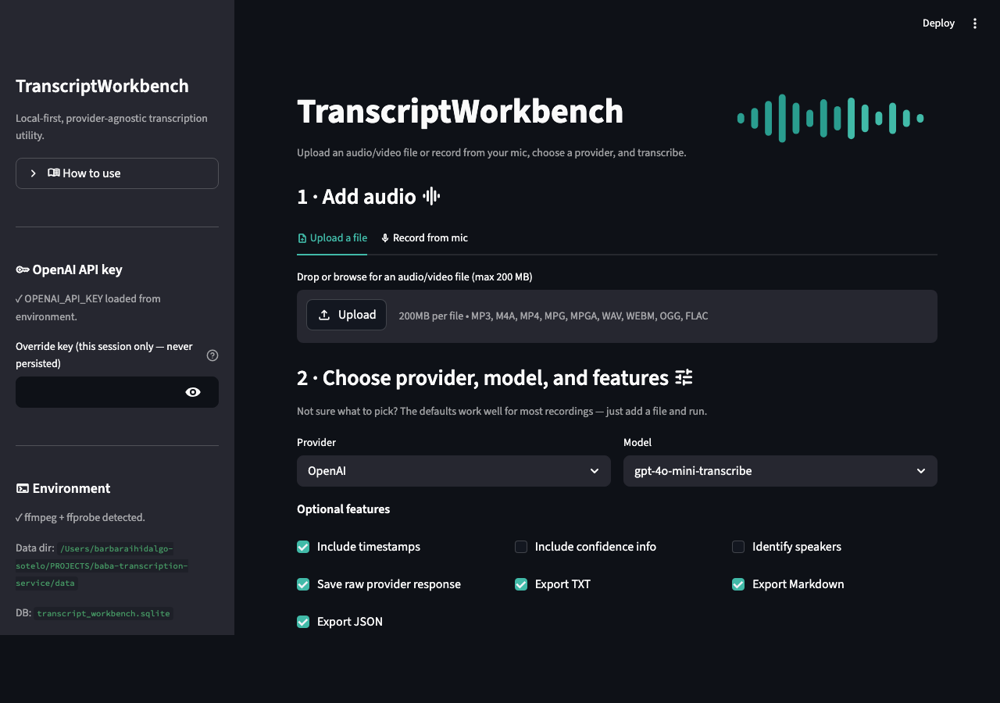
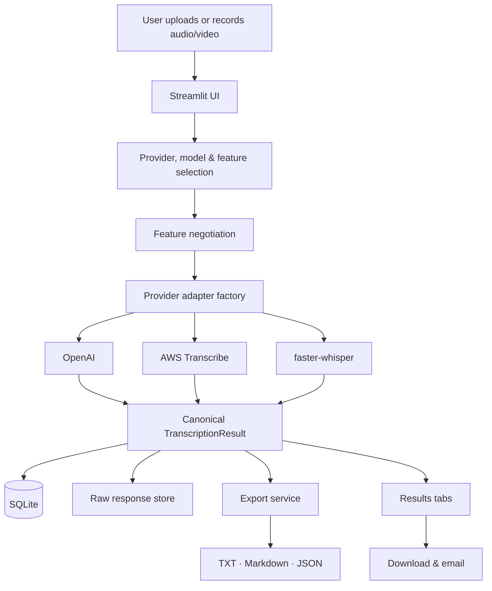

<div align="center">


# TranscriptWorkbench

**A local-first, provider-agnostic workbench for turning audio and video into readable, structured transcripts.**

[](https://www.python.org/)
[](https://streamlit.io/)
[](https://platform.openai.com/docs/guides/speech-to-text)
[](#license)

</div>

---

Upload a recording, pick a provider, and get back a clean transcript you can read in the browser, download as TXT / Markdown / JSON, or email to someone — all from a single Streamlit app that keeps your files on your own machine.

It's built for anyone who regularly transcribes podcasts, interviews, lectures, meetings, phone calls, or voice memos and wants one consistent tool instead of juggling APIs.

<div align="center">

<br/>
<em>Upload or record, choose your features, and review the result in progressive-disclosure tabs.</em>
</div>

---

## Highlights

- **🎙️ Upload or record** — most audio and video formats (MP3, M4A, MP4, WAV, WEBM, OGG, FLAC, and more), or capture straight from your mic.
- **🔌 Provider-agnostic** — every backend maps to one canonical transcript shape, so results stay comparable. OpenAI ships today; AWS Transcribe and local faster-whisper adapters are in place.
- **🧭 Capability-aware** — ask for timestamps, confidence, or speaker labels and the app tells you what the selected model actually delivers, rather than pretending every provider is equivalent.
- **📁 Useful exports** — TXT, Markdown, and JSON for every run, plus the raw provider response for debugging and reproducibility.
- **✉️ Share by email** — send the transcript (and optionally the audio) to an allowlisted address via Gmail SMTP or AWS SES.
- **🗜️ Smart compression** — oversize files get a one-click compression step before submission, with no loss of speech accuracy.
- **💲 Cost estimates** — see an estimated cost from duration × the provider's published rate before you commit.
- **🗂️ Job history** — every run is persisted to SQLite, so past transcripts are one click away.
- **🔒 Local-first & private** — files and transcripts stay on your machine; audio is sent only to the provider you choose, using your own API key.

---

## Quick start

**Prerequisites:** Python 3.12, `ffmpeg`, and an OpenAI API key.

```bash
# 1. Install ffmpeg (macOS)
brew install ffmpeg          # Ubuntu: sudo apt install ffmpeg

# 2. Set up the environment
python3.12 -m venv .venv
source .venv/bin/activate
pip install -r requirements.txt

# 3. Configure
cp .env.example .env
# edit .env and set OPENAI_API_KEY

# 4. Run
streamlit run app.py
```

The app opens at <http://localhost:8501>. Drop in a file, keep the defaults, and hit **Run**.

```bash
# Run the test suite
python -m pytest tests/
```

---

## How it works

The guiding rule is that [`app.py`](app.py) stays thin: it composes UI sections and calls services. Provider API calls, parsing, SQL, feature negotiation, and export formatting all live in dedicated modules.



### Design principles

| Principle | What it means |
|---|---|
| **Local-first** | Runs locally through Streamlit; fast dev loop, no deployment required to be useful. |
| **Provider-agnostic** | Each provider is an adapter returning the same canonical result shape. |
| **Capability-driven** | Users choose what they want; the app reports what each provider/model can actually do. |
| **SQLite early** | Job metadata, runs, segments, words, and artifacts are persisted from day one. |
| **Preserve raw outputs** | Every raw provider response is saved unchanged for debugging and re-parsing. |
| **Diarization-ready** | Speaker fields exist in the schema now, so adding diarization later needs no migration. |

### Capability negotiation

Rather than assume providers return equivalent output, the app records the **requested** features against the **effective** support the chosen model offers:

| Status | Meaning |
|---|---|
| `supported` | Directly supported by the selected provider/model |
| `partial` | Supported, with caveats |
| `proxy` | Available only as an approximate signal (e.g. a logprob proxy for confidence) |
| `diagnostic` | Model diagnostic information, not calibrated confidence |
| `unsupported` | Not available |
| `not_requested` | The user didn't ask for this feature |

---

## Providers

| Provider | Status | Best for |
|---|---|---|
| **OpenAI** | ✅ Shipping | Easy, high-quality transcription — the default path |
| **AWS Transcribe** | 🔧 Adapter complete | Word-level confidence and speaker diarization |
| **faster-whisper** (local) | 🔧 Adapter complete | Private, offline, open-source transcription |
| AssemblyAI · Deepgram · Google · Azure | 💡 On the roadmap | Managed metadata, streaming, and cross-provider benchmarking |

> AWS Transcribe and faster-whisper adapters are implemented and registered; AWS is pending an account upgrade and faster-whisper is pending functional testing. See [`docs/AWS_TRANSCRIBE_SETUP.md`](docs/AWS_TRANSCRIBE_SETUP.md).

---

## Configuration

Only `OPENAI_API_KEY` is required to get started. Everything else has sensible defaults — see [`.env.example`](.env.example) for the full annotated list.

```bash
OPENAI_API_KEY=                       # required
TRANSCRIPT_WORKBENCH_DATA_DIR=./data
MAX_UPLOAD_MB=200
LOW_CONFIDENCE_THRESHOLD=0.80
DEFAULT_PROVIDER=openai
DEFAULT_MODEL=gpt-4o-mini-transcribe

# Email sharing (optional) — see docs/EMAIL_SETUP.md
EMAIL_PROVIDER=smtp                   # "smtp" (Gmail app password) or "ses" (AWS SES)
EMAIL_SENDER=
EMAIL_RECIPIENTS=                     # comma-separated allowlist
```

The app also supports a **bring-your-own-token** flow: an OpenAI key can be entered in the sidebar for the current session only, never persisted — useful for shared or deployed instances.

---

## Project layout

```text
app.py                      # thin Streamlit entry point
transcript_workbench/
  config.py · constants.py
  db/                       # SQLite connection, schema, repository
  models/                   # canonical transcript + feature schemas
  providers/                # adapters, factory, registry, pricing
  services/                 # audio, files, transcription, exports, email, confidence
  ui/                       # upload, configuration, results, history, compression
  utils/                    # ids, hashing, time, logging
tests/                      # feature negotiation, exports, repository, parsing, pricing, email
docs/                       # setup and deployment guides (see below)
data/                       # local SQLite db and per-job files (gitignored)
```

---

## Documentation

| Document | Purpose |
|---|---|
| [`docs/REQUIREMENTS.md`](docs/REQUIREMENTS.md) | Functional and non-functional requirements |
| [`docs/IMPLEMENTATION_PLAN.md`](docs/IMPLEMENTATION_PLAN.md) | Architecture, module structure, schemas, and service boundaries |
| [`docs/USER_GUIDE.md`](docs/USER_GUIDE.md) | End-user instructions for running the app locally and on EC2 |
| [`docs/UAT_CHECKLIST.md`](docs/UAT_CHECKLIST.md) | Step-by-step user-acceptance test plan |
| [`docs/AWS_TRANSCRIBE_SETUP.md`](docs/AWS_TRANSCRIBE_SETUP.md) | AWS IAM, S3, and Transcribe setup for the AWS provider |
| [`docs/EMAIL_SETUP.md`](docs/EMAIL_SETUP.md) | Email-sharing setup for Gmail SMTP and AWS SES |
| [`docs/DEPLOYMENT.md`](docs/DEPLOYMENT.md) | EC2 deployment, including custom domain and HTTPS |

New to the codebase? Start with `REQUIREMENTS.md` for the *what*, then `IMPLEMENTATION_PLAN.md` for the *how*.

---

## Testing

The suite covers the parts most likely to break or become provider-specific — feature negotiation, the SQLite repository, export and email formatting, OpenAI response parsing, and cost estimation. Fixture JSON responses let parsing be tested without calling external APIs.

```bash
python -m pytest tests/
```

---

## Privacy & open-source posture

TranscriptWorkbench is designed to be safe to open source as a bring-your-own-token utility:

- `.env`, uploaded audio, and raw provider outputs are never committed (see [`.gitignore`](.gitignore)).
- Provider keys are optional unless the provider is selected.
- Implemented vs planned providers are clearly labeled.

---

## License

Not yet licensed. A license will be chosen before any public release — likely **MIT** for a permissive utility, or **Apache 2.0** if patent language matters.

---

## Status

The MVP is implemented and running: Streamlit UI, SQLite persistence, the OpenAI provider end-to-end, capability negotiation, TXT/Markdown/JSON exports, in-app compression, cost estimation, email sharing, and job history. AWS Transcribe and faster-whisper adapters are written and registered, pending account access and functional testing respectively.
