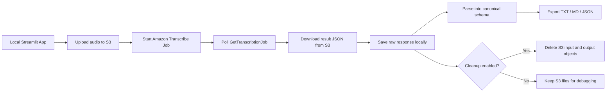
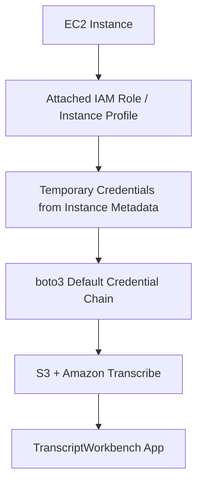

# AWS Transcribe Setup Guide for TranscriptWorkbench

This guide walks through the AWS setup for adding **Amazon Transcribe** as the next provider in TranscriptWorkbench.

The short version:

- Use **one private S3 bucket** for temporary audio input and transcript JSON output.
- Use **one least-privilege IAM policy** that allows only the S3 and Transcribe actions the app needs.
- Use an **IAM user + named AWS profile** for local development.
- Use an **EC2 IAM role / instance profile** later, so the deployed app does not store long-lived AWS access keys.

---

## Immediate answer: what do I select for “Select a service”?

If you are in **IAM > Policies > Create policy** and AWS asks you to **Select a service**, you have two good options.

### Option A: Use the JSON editor, recommended

Choose the **JSON** tab instead of the visual editor and paste the full policy in the section below.

This is the easiest path because this app needs permissions for **two services**:

1. **Amazon S3**
2. **Amazon Transcribe**

The JSON editor lets you define both in one policy.

### Option B: Use the visual editor

If you prefer the visual editor:

1. Select **S3** first.
2. Add the S3 permissions and resources.
3. Click **Add more permissions**.
4. Select **Transcribe**.
5. Add the Transcribe permissions.
6. Continue to review and create the policy.

In the visual editor, each permission block covers one AWS service. Since this project needs both S3 and Transcribe, you need either multiple permission blocks or the JSON editor.

---

## Architecture overview



The app should not depend on AWS Transcribe-specific output shapes in the UI. The AWS adapter should convert the raw AWS response into the app's canonical transcript model.

---

## Stage 0: Decide your region and bucket name

Choose one AWS region and use it consistently.

Recommended for a simple MVP:

```bash
AWS_DEFAULT_REGION=us-east-1
```

Then choose a globally unique bucket name. Examples:

```text
transcript-workbench-yourname-dev
sensemaking-transcribe-dev
```

Avoid names that expose anything sensitive. Bucket names are globally unique and can sometimes appear in logs, errors, or generated URIs.

### Success criteria

You have decided:

```bash
AWS_DEFAULT_REGION=<your-region>
AWS_TRANSCRIBE_BUCKET=<your-bucket-name>
```

You will use the same region for:

- the S3 bucket
- the Transcribe client
- the `.env` value
- local CLI smoke tests

---

## Stage 1: Create the S3 bucket

In the AWS Console:

1. Go to **S3**.
2. Click **Create bucket**.
3. Enter your bucket name.
4. Select your chosen AWS region.
5. Keep **Block all public access** enabled.
6. Keep default encryption enabled. The default SSE-S3 encryption is fine for this MVP.
7. Create the bucket.

Recommended prefix structure:

```text
s3://YOUR_BUCKET_NAME/transcribe-input/
s3://YOUR_BUCKET_NAME/transcribe-output/
```

You do not need to manually create these folders. S3 is object storage; the app or CLI can create objects using those prefixes.

### Success criteria

In the S3 console:

- The bucket exists.
- It is in the selected region.
- Public access is blocked.
- Default encryption is enabled.
- There are no public bucket policies or public ACLs.

---

## Stage 2: Create the IAM policy

Go to:

```text
IAM > Policies > Create policy
```

Choose the **JSON** editor and paste this policy.

Replace both instances of `YOUR_BUCKET_NAME_HERE` with your real bucket name.

```json
{
  "Version": "2012-10-17",
  "Statement": [
    {
      "Sid": "TranscribeJobAccess",
      "Effect": "Allow",
      "Action": [
        "transcribe:StartTranscriptionJob",
        "transcribe:GetTranscriptionJob",
        "transcribe:ListTranscriptionJobs",
        "transcribe:DeleteTranscriptionJob"
      ],
      "Resource": "*"
    },
    {
      "Sid": "S3BucketVerification",
      "Effect": "Allow",
      "Action": [
        "s3:GetBucketLocation",
        "s3:ListBucket"
      ],
      "Resource": "arn:aws:s3:::YOUR_BUCKET_NAME_HERE"
    },
    {
      "Sid": "S3ObjectAccessForTranscriptionJobs",
      "Effect": "Allow",
      "Action": [
        "s3:PutObject",
        "s3:GetObject",
        "s3:DeleteObject"
      ],
      "Resource": "arn:aws:s3:::YOUR_BUCKET_NAME_HERE/*"
    }
  ]
}
```

Name the policy something clear, for example:

```text
TranscriptWorkbenchTranscribePolicy
```

### Why each permission exists

| Permission | Why it is needed |
|---|---|
| `transcribe:StartTranscriptionJob` | Starts the async AWS Transcribe job. |
| `transcribe:GetTranscriptionJob` | Lets the app poll for job completion or failure. |
| `transcribe:ListTranscriptionJobs` | Useful for debugging and optional provider status/history. |
| `transcribe:DeleteTranscriptionJob` | Lets the app clean up Transcribe job metadata later if desired. |
| `s3:GetBucketLocation` | Lets the app verify that the bucket region matches `AWS_DEFAULT_REGION`. |
| `s3:ListBucket` | Lets the app verify access to the bucket and inspect expected prefixes. |
| `s3:PutObject` | Lets the app upload the audio file and lets Transcribe write result JSON to the bucket. |
| `s3:GetObject` | Lets the app download the result JSON. |
| `s3:DeleteObject` | Lets the app remove temporary S3 files after saving them locally. |

### Why `Resource: "*"` for Transcribe?

For this MVP, keep the Transcribe actions scoped to `"Resource": "*"`. The S3 permissions are tightly scoped to the single app bucket, which is the important least-privilege boundary for the audio and transcript files.

### Success criteria

The policy is created successfully and appears under:

```text
IAM > Policies > TranscriptWorkbenchTranscribePolicy
```

The policy JSON validates in the AWS console with no syntax errors.

---

## Stage 3: Create or choose a local-development IAM user

For local development, use an IAM user with an access key.

In the AWS Console:

1. Go to **IAM > Users**.
2. Create a user such as:

```text
transcript-workbench-dev
```

3. Do not give this user console access unless you specifically need it.
4. Attach the policy:

```text
TranscriptWorkbenchTranscribePolicy
```

5. Create an access key for CLI/local code use.
6. Save the access key ID and secret access key securely.

### Success criteria

The IAM user exists and has the `TranscriptWorkbenchTranscribePolicy` attached.

The user has one active access key for local development.

---

## Stage 4: Configure local AWS credentials

On your local machine, configure a named AWS profile:

```bash
aws configure --profile transcript-workbench
```

Enter:

```text
AWS Access Key ID: <your-access-key-id>
AWS Secret Access Key: <your-secret-access-key>
Default region name: <your-region>
Default output format: json
```

Then confirm the profile works:

```bash
aws sts get-caller-identity --profile transcript-workbench
```

Expected result:

- It returns your AWS account ID.
- The ARN includes your local IAM user name, for example:

```text
arn:aws:iam::<account-id>:user/transcript-workbench-dev
```

### Success criteria

This command works:

```bash
aws sts get-caller-identity --profile transcript-workbench
```

And it shows the expected IAM user.

---

## Stage 5: Add local `.env` values

In your project `.env` file:

```bash
AWS_PROFILE=transcript-workbench
AWS_DEFAULT_REGION=us-east-1
AWS_TRANSCRIBE_BUCKET=your-bucket-name
AWS_TRANSCRIBE_CLEANUP_S3=true
AWS_TRANSCRIBE_POLL_SECONDS=5
AWS_TRANSCRIBE_MAX_WAIT_SECONDS=1800
```

Adjust `AWS_DEFAULT_REGION` and `AWS_TRANSCRIBE_BUCKET` to your real values.

### What these mean

| Variable | Meaning |
|---|---|
| `AWS_PROFILE` | The local named AWS profile used by boto3/AWS CLI. |
| `AWS_DEFAULT_REGION` | The AWS region for S3 and Transcribe. |
| `AWS_TRANSCRIBE_BUCKET` | The private bucket used for audio input and result JSON. |
| `AWS_TRANSCRIBE_CLEANUP_S3` | Whether the app should delete S3 objects after successful local save. |
| `AWS_TRANSCRIBE_POLL_SECONDS` | How often the app polls the async Transcribe job. |
| `AWS_TRANSCRIBE_MAX_WAIT_SECONDS` | Maximum wait time before the app gives up polling. |

### Success criteria

Your app can read these variables without hardcoding them.

Your `.env` file is listed in `.gitignore` and will not be committed.

---

## Stage 6: Install the AWS Python dependency

Activate your virtual environment and install `boto3`:

```bash
source .venv/bin/activate
pip install boto3
pip freeze > requirements.txt
```

### Success criteria

This works:

```bash
python -c "import boto3; print(boto3.__version__)"
```

---

## Stage 7: Smoke test S3 from your local machine

Export your local profile and environment values:

```bash
export AWS_PROFILE=transcript-workbench
export AWS_DEFAULT_REGION=us-east-1
export AWS_TRANSCRIBE_BUCKET=your-bucket-name
```

Check bucket location:

```bash
aws s3api get-bucket-location \
  --bucket "$AWS_TRANSCRIBE_BUCKET"
```

Upload a tiny test file:

```bash
echo "hello transcript workbench" > /tmp/tw-test.txt

aws s3 cp /tmp/tw-test.txt \
  "s3://$AWS_TRANSCRIBE_BUCKET/transcribe-input/tw-test.txt"
```

Download it:

```bash
aws s3 cp \
  "s3://$AWS_TRANSCRIBE_BUCKET/transcribe-input/tw-test.txt" \
  /tmp/tw-test-downloaded.txt
```

Delete it:

```bash
aws s3 rm \
  "s3://$AWS_TRANSCRIBE_BUCKET/transcribe-input/tw-test.txt"
```

### Success criteria

All four commands work:

1. Bucket location is returned.
2. Upload succeeds.
3. Download succeeds.
4. Delete succeeds.

If any command returns `AccessDenied`, the IAM policy is missing the corresponding S3 permission or the bucket name/region is wrong.

---

## Stage 8: Smoke test Transcribe from your local machine

Use a short audio file, preferably under one minute, such as:

```text
sample.wav
sample.mp3
sample.m4a
```

Upload it:

```bash
aws s3 cp sample.wav \
  "s3://$AWS_TRANSCRIBE_BUCKET/transcribe-input/sample.wav"
```

Start a transcription job:

```bash
aws transcribe start-transcription-job \
  --region "$AWS_DEFAULT_REGION" \
  --transcription-job-name transcript-workbench-smoke-test-001 \
  --media MediaFileUri="s3://$AWS_TRANSCRIBE_BUCKET/transcribe-input/sample.wav" \
  --language-code en-US \
  --output-bucket-name "$AWS_TRANSCRIBE_BUCKET" \
  --output-key "transcribe-output/transcript-workbench-smoke-test-001.json"
```

Poll job status:

```bash
aws transcribe get-transcription-job \
  --region "$AWS_DEFAULT_REGION" \
  --transcription-job-name transcript-workbench-smoke-test-001
```

When the status is `COMPLETED`, download the result JSON:

```bash
aws s3 cp \
  "s3://$AWS_TRANSCRIBE_BUCKET/transcribe-output/transcript-workbench-smoke-test-001.json" \
  /tmp/transcript-workbench-smoke-test-001.json
```

Inspect the output:

```bash
python -m json.tool /tmp/transcript-workbench-smoke-test-001.json | head -80
```

### Success criteria

The job reaches:

```text
TranscriptionJobStatus: COMPLETED
```

The output JSON downloads successfully.

The JSON contains transcript content.

---

## Stage 9: Smoke test diarization

Upload a short audio file with at least two speakers if available.

Start a diarization job:

```bash
aws transcribe start-transcription-job \
  --region "$AWS_DEFAULT_REGION" \
  --transcription-job-name transcript-workbench-diarization-test-001 \
  --media MediaFileUri="s3://$AWS_TRANSCRIBE_BUCKET/transcribe-input/two-speaker-sample.wav" \
  --language-code en-US \
  --settings ShowSpeakerLabels=true,MaxSpeakerLabels=10 \
  --output-bucket-name "$AWS_TRANSCRIBE_BUCKET" \
  --output-key "transcribe-output/transcript-workbench-diarization-test-001.json"
```

Poll:

```bash
aws transcribe get-transcription-job \
  --region "$AWS_DEFAULT_REGION" \
  --transcription-job-name transcript-workbench-diarization-test-001
```

Download:

```bash
aws s3 cp \
  "s3://$AWS_TRANSCRIBE_BUCKET/transcribe-output/transcript-workbench-diarization-test-001.json" \
  /tmp/transcript-workbench-diarization-test-001.json
```

Look for speaker labels:

```bash
grep -n "speaker_labels\|spk_" /tmp/transcript-workbench-diarization-test-001.json | head
```

### Success criteria

The output JSON includes speaker label data, often with labels such as:

```text
spk_0
spk_1
```

If the audio has only one speaker or poor speaker separation, diarization may still complete but show limited speaker separation.

---

## Stage 10: What to tell the coding agent

Once the local AWS smoke tests pass, give the coding agent this confirmation:

```text
AWS setup is ready for the AWS Transcribe phase.

Use these assumptions:
- AWS_DEFAULT_REGION is set in .env.
- AWS_TRANSCRIBE_BUCKET is set in .env.
- Local development uses AWS_PROFILE=transcript-workbench.
- The bucket already exists and should not be created by the app.
- The app should verify credentials, bucket access, and bucket region.
- The app should upload audio to transcribe-input/.
- The app should ask Transcribe to write result JSON to transcribe-output/.
- The app should always save the raw AWS JSON locally.
- S3 cleanup should be configurable and default to delete-after-success.
- If diarization is requested, use ShowSpeakerLabels=true and MaxSpeakerLabels=10.
- Use 5-second polling and a configurable max wait, default 1800 seconds.
```

---

# Moving from local setup to EC2 credentials

Local development can use an IAM user and local access keys.

EC2 deployment should use an IAM role attached to the EC2 instance. This is more robust because the EC2 instance receives temporary credentials automatically. You do not need to store long-lived AWS access keys on the server.

## EC2 credential architecture



## Stage EC2-1: Create an IAM role for EC2

In the AWS Console:

1. Go to **IAM > Roles**.
2. Click **Create role**.
3. Trusted entity type: **AWS service**.
4. Use case: **EC2**.
5. Attach the same customer-managed policy:

```text
TranscriptWorkbenchTranscribePolicy
```

6. Name the role:

```text
TranscriptWorkbenchEC2Role
```

### Success criteria

The role exists.

Its trust relationship allows EC2 to assume it.

It has `TranscriptWorkbenchTranscribePolicy` attached.

---

## Stage EC2-2: Attach the role to your EC2 instance

In the EC2 Console:

1. Go to **EC2 > Instances**.
2. Select the instance running TranscriptWorkbench.
3. Choose **Actions > Security > Modify IAM role**.
4. Select:

```text
TranscriptWorkbenchEC2Role
```

5. Save.

### Success criteria

The instance details page shows the IAM role attached.

---

## Stage EC2-3: Remove local-style AWS secrets from the deployed app

On EC2, do not store these in `.env`:

```bash
AWS_ACCESS_KEY_ID=
AWS_SECRET_ACCESS_KEY=
AWS_SESSION_TOKEN=
AWS_PROFILE=
```

For EC2, keep only non-secret configuration:

```bash
AWS_DEFAULT_REGION=us-east-1
AWS_TRANSCRIBE_BUCKET=your-bucket-name
AWS_TRANSCRIBE_CLEANUP_S3=true
AWS_TRANSCRIBE_POLL_SECONDS=5
AWS_TRANSCRIBE_MAX_WAIT_SECONDS=1800
```

The app should rely on boto3's default credential chain to find the EC2 role credentials.

### Success criteria

On EC2:

```bash
env | grep AWS
```

does not show long-lived access keys.

It may show non-secret config like:

```text
AWS_DEFAULT_REGION
AWS_TRANSCRIBE_BUCKET
```

---

## Stage EC2-4: Verify the EC2 role credentials

SSH into the EC2 instance and run:

```bash
aws sts get-caller-identity
```

Expected result:

The ARN should look like an assumed role, not an IAM user.

Example shape:

```text
arn:aws:sts::<account-id>:assumed-role/TranscriptWorkbenchEC2Role/<instance-session-name>
```

Then test S3:

```bash
aws s3api get-bucket-location \
  --bucket "$AWS_TRANSCRIBE_BUCKET"
```

Then test upload/download/delete using the same commands from the local S3 smoke test.

### Success criteria

- `aws sts get-caller-identity` returns an assumed-role ARN.
- S3 bucket location works.
- Upload/download/delete works.
- No long-lived AWS keys are present on the EC2 instance.

---

## Stage EC2-5: Run a Transcribe smoke test from EC2

Use the same Transcribe smoke test from Stage 8, but run it on the EC2 instance without setting `AWS_PROFILE`.

### Success criteria

- The EC2 instance can start a Transcribe job.
- The job completes.
- The result JSON downloads.
- The app can save the raw response locally.

---

# Troubleshooting guide

## `AccessDenied` on S3 upload

Likely missing:

```text
s3:PutObject
```

Check the object resource ARN:

```text
arn:aws:s3:::YOUR_BUCKET_NAME/*
```

## `AccessDenied` on bucket location or list

Likely missing:

```text
s3:GetBucketLocation
s3:ListBucket
```

Check the bucket resource ARN:

```text
arn:aws:s3:::YOUR_BUCKET_NAME
```

Do not put `/*` on the bucket-level statement.

## `AccessDenied` on StartTranscriptionJob

Likely missing:

```text
transcribe:StartTranscriptionJob
```

Also check that the IAM policy is attached to the correct user or role.

## Transcribe job fails quickly

Check:

- Is the media file actually in S3?
- Is the bucket in the same region as the Transcribe request?
- Did you provide `language-code en-US` or another language option?
- Is the audio file format supported by AWS Transcribe?
- Is the job name unique?
- Does the output bucket exist?
- Does the IAM principal have `s3:PutObject` access to the output prefix?

## `ConflictException` or job already exists

AWS Transcribe job names must be unique.

Use a UUID or timestamp in the app's job name:

```text
tw-<job_id>
```

## `NoCredentialsError` in Python

For local development:

- Confirm `AWS_PROFILE=transcript-workbench`.
- Run `aws sts get-caller-identity --profile transcript-workbench`.
- Confirm your shell or app process can see `.env`.

For EC2:

- Confirm the IAM role is attached to the instance.
- Run `aws sts get-caller-identity` on the EC2 instance.
- Do not set `AWS_PROFILE` on EC2 unless you intentionally configured one.

## Region mismatch

If your bucket is in `us-east-1` but your app uses `us-west-2`, Transcribe will fail or be unable to access the media correctly.

The app should verify:

```text
bucket_region == AWS_DEFAULT_REGION
```

before starting a job.

---

# Recommended final checklist

Before asking the coding agent to implement the AWS adapter, confirm:

- [ ] S3 bucket exists.
- [ ] Bucket is private.
- [ ] Bucket region matches `AWS_DEFAULT_REGION`.
- [ ] IAM policy exists.
- [ ] Local IAM user has the policy attached.
- [ ] `aws sts get-caller-identity --profile transcript-workbench` works locally.
- [ ] Local S3 upload/download/delete smoke test passes.
- [ ] Local Transcribe smoke test completes.
- [ ] Optional diarization smoke test completes.
- [ ] `.env` contains the correct non-secret AWS settings.
- [ ] `.env` is ignored by Git.
- [ ] `boto3` is installed.
- [ ] Coding agent has been told not to create the bucket in the app.
- [ ] Coding agent has been told to preserve raw AWS output locally before any S3 cleanup.

---

# Official AWS references

- IAM policy creation in console: https://docs.aws.amazon.com/IAM/latest/UserGuide/access_policies_create-console.html
- Customer managed IAM policies: https://docs.aws.amazon.com/IAM/latest/UserGuide/access_policies_create.html
- Amazon Transcribe IAM examples: https://docs.aws.amazon.com/transcribe/latest/dg/security_iam_id-based-policy-examples.html
- Amazon Transcribe `StartTranscriptionJob`: https://docs.aws.amazon.com/transcribe/latest/APIReference/API_StartTranscriptionJob.html
- Amazon Transcribe CLI `start-transcription-job`: https://docs.aws.amazon.com/cli/v1/reference/transcribe/start-transcription-job.html
- IAM roles for Amazon EC2: https://docs.aws.amazon.com/AWSEC2/latest/UserGuide/iam-roles-for-amazon-ec2.html
- Use IAM role for EC2 applications: https://docs.aws.amazon.com/IAM/latest/UserGuide/id_roles_use_switch-role-ec2.html
- Instance profile concept: https://docs.aws.amazon.com/IAM/latest/UserGuide/id_roles_use_switch-role-ec2_instance-profiles.html
- EC2 instance metadata credentials: https://docs.aws.amazon.com/AWSEC2/latest/UserGuide/instance-metadata-security-credentials.html
- S3 Block Public Access: https://docs.aws.amazon.com/AmazonS3/latest/userguide/access-control-block-public-access.html
- S3 server-side encryption: https://docs.aws.amazon.com/AmazonS3/latest/userguide/UsingServerSideEncryption.html
