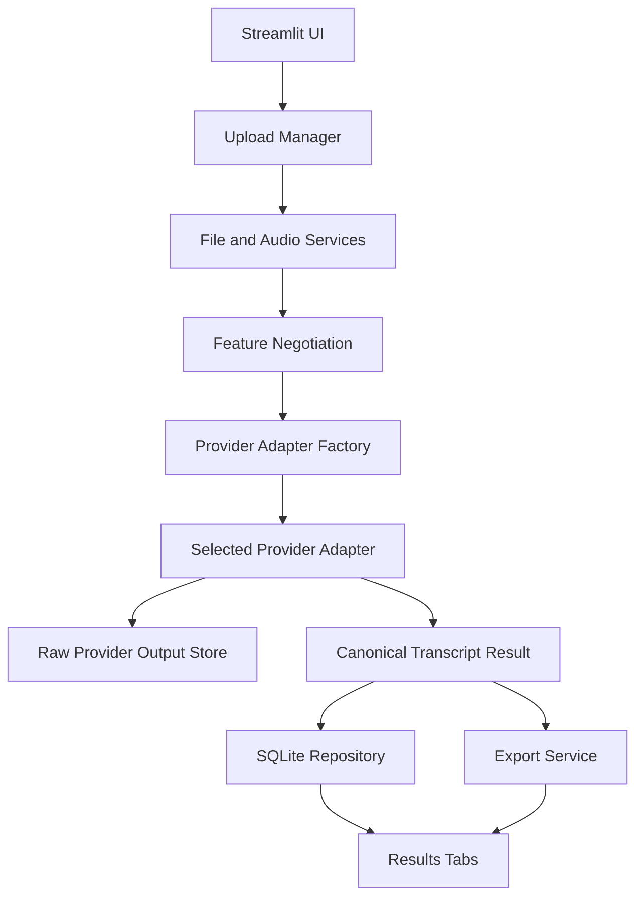

# TranscriptWorkbench Implementation Plan

## Purpose

This document gives a coding agent enough context to implement the MVP of TranscriptWorkbench: a local-first, provider-agnostic transcription utility.

The app should be useful quickly, but its architecture should support AWS confidence/diarization, local open-source transcription, provider comparison, and later deployment without a redesign.

---

# Implementation strategy

Build the app in progressive layers:

1. Skeleton app and provider registry
2. SQLite persistence and job directories
3. OpenAI transcription MVP
4. Result tabs and exports
5. AWS Transcribe backend
6. Local faster-whisper backend
7. Job history and dashboarding

The first implementation should optimize for clear structure over cleverness.

---

# High-level architecture



## Critical architecture rule

`app.py` should be thin.

It should orchestrate UI sections and call services, but it should not contain:

- provider-specific API calls
- SQL queries
- raw provider parsing
- export formatting logic
- feature negotiation rules

---

# Recommended repository structure

```text
transcript-workbench/
  app.py
  README.md
  REQUIREMENTS.md
  IMPLEMENTATION_PLAN.md
  USER_GUIDE.md
  .env.example
  .gitignore
  requirements.txt

  transcript_workbench/
    __init__.py
    config.py
    constants.py

    db/
      __init__.py
      connection.py
      schema.sql
      repository.py

    models/
      __init__.py
      canonical.py
      features.py

    providers/
      __init__.py
      base.py
      factory.py
      registry.py
      openai_provider.py
      aws_provider.py
      faster_whisper_provider.py

    services/
      __init__.py
      audio.py
      files.py
      feature_negotiation.py
      transcription.py
      exports.py
      confidence.py

    ui/
      __init__.py
      upload.py
      configuration.py
      results.py
      history.py

    utils/
      __init__.py
      ids.py
      hashing.py
      time.py
      logging.py

  tests/
    test_feature_negotiation.py
    test_exports.py
    test_sqlite_repository.py
    test_openai_parser.py
    fixtures/
      sample_openai_response.json
      sample_aws_response.json

  data/
    .gitkeep
```

---

# Dependencies

## MVP requirements

```text
streamlit
openai
python-dotenv
pydantic
pandas
```

## Recommended for audio handling

```text
ffmpeg-python
```

You may also call `ffmpeg` and `ffprobe` via `subprocess`.

## Near-term additions

```text
boto3
faster-whisper
```

## Later additions

```text
plotly
altair
assemblyai
deepgram-sdk
whisperx
pyannote.audio
```

Avoid adding all optional provider SDKs in the MVP.

---

# Configuration

## `.env.example`

```bash
OPENAI_API_KEY=

AWS_ACCESS_KEY_ID=
AWS_SECRET_ACCESS_KEY=
AWS_DEFAULT_REGION=us-east-1
AWS_TRANSCRIBE_BUCKET=

ASSEMBLYAI_API_KEY=
DEEPGRAM_API_KEY=

TRANSCRIPT_WORKBENCH_DATA_DIR=./data
MAX_UPLOAD_MB=200
LOW_CONFIDENCE_THRESHOLD=0.80
```

## `transcript_workbench/config.py`

```python
from dataclasses import dataclass
from pathlib import Path
import os
from dotenv import load_dotenv

load_dotenv()

@dataclass
class AppConfig:
    data_dir: Path
    openai_api_key: str | None
    aws_region: str
    aws_bucket: str | None
    low_confidence_threshold: float

def get_config() -> AppConfig:
    data_dir = Path(os.getenv("TRANSCRIPT_WORKBENCH_DATA_DIR", "./data"))
    data_dir.mkdir(parents=True, exist_ok=True)

    return AppConfig(
        data_dir=data_dir,
        openai_api_key=os.getenv("OPENAI_API_KEY"),
        aws_region=os.getenv("AWS_DEFAULT_REGION", "us-east-1"),
        aws_bucket=os.getenv("AWS_TRANSCRIBE_BUCKET"),
        low_confidence_threshold=float(os.getenv("LOW_CONFIDENCE_THRESHOLD", "0.80")),
    )
```

---

# Canonical models

Create `transcript_workbench/models/canonical.py`.

```python
from datetime import datetime
from typing import Any, Optional
from pydantic import BaseModel, Field

class RequestedFeatures(BaseModel):
    timestamps: bool = True
    confidence: bool = False
    diarization: bool = False
    save_raw: bool = True
    export_txt: bool = True
    export_md: bool = True
    export_json: bool = True
    export_srt: bool = False
    export_vtt: bool = False

class EffectiveFeatures(BaseModel):
    timestamps: str = "not_requested"
    confidence: str = "not_requested"
    diarization: str = "not_requested"
    save_raw: str = "supported"

class TranscriptSegment(BaseModel):
    segment_id: str
    job_id: str
    segment_index: int
    start_seconds: Optional[float] = None
    end_seconds: Optional[float] = None
    speaker: Optional[str] = None
    text: str
    confidence: Optional[float] = None
    confidence_type: str = "none"
    provider_metadata: dict[str, Any] = Field(default_factory=dict)

class TranscriptWord(BaseModel):
    word_id: str
    job_id: str
    segment_id: Optional[str] = None
    word_index: int
    start_seconds: Optional[float] = None
    end_seconds: Optional[float] = None
    speaker: Optional[str] = None
    word: str
    confidence: Optional[float] = None
    confidence_type: str = "none"
    provider_metadata: dict[str, Any] = Field(default_factory=dict)

class TranscriptionJob(BaseModel):
    job_id: str
    created_at: datetime
    completed_at: Optional[datetime] = None
    status: str
    original_filename: str
    file_hash: Optional[str] = None
    duration_seconds: Optional[float] = None
    provider: str
    model: str
    requested_features: RequestedFeatures
    effective_features: EffectiveFeatures
    warnings: list[str] = Field(default_factory=list)

class TranscriptionResult(BaseModel):
    job: TranscriptionJob
    text: str
    segments: list[TranscriptSegment] = Field(default_factory=list)
    words: list[TranscriptWord] = Field(default_factory=list)
    raw_response_path: Optional[str] = None
    artifacts: dict[str, str] = Field(default_factory=dict)
```

---

# Provider registry

Create `transcript_workbench/providers/registry.py`.

```python
PROVIDER_REGISTRY = {
    "openai": {
        "display_name": "OpenAI",
        "models": {
            "gpt-4o-mini-transcribe": {
                "timestamps": "partial",
                "confidence": "proxy",
                "diarization": "unsupported",
                "notes": [
                    "Good default for fast transcription.",
                    "Confidence should be treated as a proxy when available."
                ],
            },
            "gpt-4o-transcribe": {
                "timestamps": "partial",
                "confidence": "proxy",
                "diarization": "unsupported",
                "notes": [
                    "Higher-quality OpenAI transcription model.",
                    "Confidence should be treated as a proxy when available."
                ],
            },
            "gpt-4o-transcribe-diarize": {
                "timestamps": "partial",
                "confidence": "unsupported",
                "diarization": "supported",
                "notes": [
                    "Use when speaker labels matter.",
                    "Do not assume calibrated word-level confidence."
                ],
            },
        },
    },
    "aws": {
        "display_name": "AWS Transcribe",
        "models": {
            "standard": {
                "timestamps": "supported",
                "confidence": "supported",
                "diarization": "supported",
                "notes": [
                    "Best near-term backend for word-level confidence and diarization."
                ],
            }
        },
    },
    "faster_whisper": {
        "display_name": "Local faster-whisper",
        "models": {
            "small": {
                "timestamps": "partial",
                "confidence": "diagnostic",
                "diarization": "unsupported",
                "notes": [
                    "Local open-source transcription.",
                    "Confidence is diagnostic, not calibrated."
                ],
            },
            "medium": {
                "timestamps": "partial",
                "confidence": "diagnostic",
                "diarization": "unsupported",
                "notes": [
                    "Higher-quality local model, slower than small."
                ],
            },
        },
    },
}
```

---

# Feature negotiation service

Create `transcript_workbench/services/feature_negotiation.py`.

```python
from transcript_workbench.models.canonical import RequestedFeatures, EffectiveFeatures
from transcript_workbench.providers.registry import PROVIDER_REGISTRY

def resolve_effective_features(
    provider: str,
    model: str,
    requested: RequestedFeatures,
) -> tuple[EffectiveFeatures, list[str]]:
    model_config = PROVIDER_REGISTRY[provider]["models"][model]
    warnings = list(model_config.get("notes", []))

    def resolve(feature_name: str, requested_value: bool) -> str:
        if not requested_value:
            return "not_requested"
        return model_config.get(feature_name, "unsupported")

    effective = EffectiveFeatures(
        timestamps=resolve("timestamps", requested.timestamps),
        confidence=resolve("confidence", requested.confidence),
        diarization=resolve("diarization", requested.diarization),
        save_raw="supported" if requested.save_raw else "not_requested",
    )

    if requested.confidence and effective.confidence in {"proxy", "diagnostic"}:
        warnings.append(
            "Confidence is not calibrated word-level confidence for this provider/model."
        )

    if requested.diarization and effective.diarization == "unsupported":
        warnings.append(
            "Speaker diarization was requested but is not supported by this provider/model."
        )

    return effective, warnings
```

Unit tests should cover:

- OpenAI mini with confidence requested
- OpenAI diarize with diarization requested
- faster-whisper with diarization requested
- AWS with confidence and diarization requested
- unchecked features returning `not_requested`

---

# SQLite implementation

## `transcript_workbench/db/schema.sql`

```sql
CREATE TABLE IF NOT EXISTS transcription_jobs (
    job_id TEXT PRIMARY KEY,
    status TEXT NOT NULL,
    original_filename TEXT NOT NULL,
    file_hash TEXT,
    duration_seconds REAL,
    provider TEXT NOT NULL,
    model TEXT NOT NULL,
    requested_features_json TEXT NOT NULL,
    effective_features_json TEXT NOT NULL,
    warnings_json TEXT,
    created_at TEXT NOT NULL,
    completed_at TEXT
);

CREATE TABLE IF NOT EXISTS provider_runs (
    run_id TEXT PRIMARY KEY,
    job_id TEXT NOT NULL,
    provider TEXT NOT NULL,
    model TEXT NOT NULL,
    status TEXT NOT NULL,
    runtime_seconds REAL,
    cost_estimate_usd REAL,
    raw_response_path TEXT,
    error_json TEXT,
    started_at TEXT NOT NULL,
    completed_at TEXT,
    FOREIGN KEY(job_id) REFERENCES transcription_jobs(job_id)
);

CREATE TABLE IF NOT EXISTS transcript_segments (
    segment_id TEXT PRIMARY KEY,
    job_id TEXT NOT NULL,
    segment_index INTEGER NOT NULL,
    start_seconds REAL,
    end_seconds REAL,
    speaker TEXT,
    text TEXT NOT NULL,
    confidence REAL,
    confidence_type TEXT NOT NULL,
    provider_metadata_json TEXT,
    FOREIGN KEY(job_id) REFERENCES transcription_jobs(job_id)
);

CREATE TABLE IF NOT EXISTS transcript_words (
    word_id TEXT PRIMARY KEY,
    job_id TEXT NOT NULL,
    segment_id TEXT,
    word_index INTEGER NOT NULL,
    start_seconds REAL,
    end_seconds REAL,
    speaker TEXT,
    word TEXT NOT NULL,
    confidence REAL,
    confidence_type TEXT NOT NULL,
    provider_metadata_json TEXT,
    FOREIGN KEY(job_id) REFERENCES transcription_jobs(job_id),
    FOREIGN KEY(segment_id) REFERENCES transcript_segments(segment_id)
);

CREATE TABLE IF NOT EXISTS artifacts (
    artifact_id TEXT PRIMARY KEY,
    job_id TEXT NOT NULL,
    artifact_type TEXT NOT NULL,
    path TEXT NOT NULL,
    created_at TEXT NOT NULL,
    FOREIGN KEY(job_id) REFERENCES transcription_jobs(job_id)
);
```

## `transcript_workbench/db/connection.py`

```python
from pathlib import Path
import sqlite3

def get_connection(db_path: Path) -> sqlite3.Connection:
    conn = sqlite3.connect(db_path)
    conn.row_factory = sqlite3.Row
    return conn

def initialize_database(db_path: Path, schema_path: Path) -> None:
    conn = get_connection(db_path)
    try:
        conn.executescript(schema_path.read_text())
        conn.commit()
    finally:
        conn.close()
```

## Repository responsibilities

Create `transcript_workbench/db/repository.py`.

It should expose functions or a class for:

- `create_job`
- `update_job_status`
- `insert_provider_run`
- `insert_segments`
- `insert_words`
- `insert_artifact`
- `list_recent_jobs`
- `get_job`
- `get_job_segments`
- `get_job_words`

Keep SQL out of Streamlit UI files.

---

# File services

Create `transcript_workbench/services/files.py`.

Responsibilities:

- create job directory
- save uploaded file
- compute file hash
- return paths for input, raw output, and exports

Suggested structure:

```text
data/jobs/<job_id>/
  input/
  raw/
  exports/
```

Create `transcript_workbench/utils/ids.py`.

```python
from uuid import uuid4

def new_id() -> str:
    return str(uuid4())
```

Create `transcript_workbench/utils/hashing.py`.

```python
import hashlib
from pathlib import Path

def sha256_file(path: Path, chunk_size: int = 1024 * 1024) -> str:
    h = hashlib.sha256()
    with path.open("rb") as f:
        while chunk := f.read(chunk_size):
            h.update(chunk)
    return h.hexdigest()
```

---

# Audio service

Create `transcript_workbench/services/audio.py`.

MVP can simply pass compatible files through, but this service should exist.

Responsibilities:

- inspect metadata with `ffprobe`
- optionally normalize audio with `ffmpeg`
- return duration when available
- provide useful errors if `ffmpeg` is missing

Example:

```python
import json
import subprocess
from pathlib import Path

def ffprobe_metadata(path: Path) -> dict:
    cmd = [
        "ffprobe",
        "-v", "error",
        "-show_format",
        "-show_streams",
        "-of", "json",
        str(path),
    ]
    completed = subprocess.run(cmd, capture_output=True, text=True, check=True)
    return json.loads(completed.stdout)

def normalize_to_wav(input_path: Path, output_path: Path) -> Path:
    cmd = [
        "ffmpeg",
        "-y",
        "-i", str(input_path),
        "-ac", "1",
        "-ar", "16000",
        str(output_path),
    ]
    subprocess.run(cmd, capture_output=True, text=True, check=True)
    return output_path
```

---

# Provider adapter interface

Create `transcript_workbench/providers/base.py`.

```python
from abc import ABC, abstractmethod
from pathlib import Path

class ProviderAdapter(ABC):
    provider_name: str

    @abstractmethod
    def validate_config(self) -> list[str]:
        raise NotImplementedError

    @abstractmethod
    def transcribe(
        self,
        audio_path: Path,
        job_id: str,
        model: str,
        requested_features,
        effective_features,
        raw_output_path: Path,
    ):
        raise NotImplementedError
```

Create `transcript_workbench/providers/factory.py`.

```python
from transcript_workbench.providers.openai_provider import OpenAIProvider

def get_provider(provider_name: str, config):
    if provider_name == "openai":
        return OpenAIProvider(config)
    raise ValueError(f"Unsupported provider: {provider_name}")
```

Later, add AWS and faster-whisper branches.

---

# OpenAI provider

Create `transcript_workbench/providers/openai_provider.py`.

MVP tasks:

1. Validate `OPENAI_API_KEY`.
2. Submit audio file.
3. Save raw response JSON.
4. Extract transcript text.
5. Create canonical segment.
6. Return canonical result.

Pseudo-implementation:

```python
from pathlib import Path
import json
from datetime import datetime, timezone
from openai import OpenAI

from transcript_workbench.models.canonical import (
    TranscriptionResult,
    TranscriptionJob,
    TranscriptSegment,
)
from transcript_workbench.providers.base import ProviderAdapter
from transcript_workbench.utils.ids import new_id

class OpenAIProvider(ProviderAdapter):
    provider_name = "openai"

    def __init__(self, config):
        self.config = config
        self.client = OpenAI(api_key=config.openai_api_key)

    def validate_config(self) -> list[str]:
        if not self.config.openai_api_key:
            return ["OPENAI_API_KEY is missing."]
        return []

    def transcribe(
        self,
        audio_path: Path,
        job_id: str,
        model: str,
        requested_features,
        effective_features,
        raw_output_path: Path,
    ) -> TranscriptionResult:
        with audio_path.open("rb") as audio_file:
            response = self.client.audio.transcriptions.create(
                model=model,
                file=audio_file,
                response_format="json",
            )

        if hasattr(response, "model_dump"):
            raw = response.model_dump()
        elif isinstance(response, dict):
            raw = response
        else:
            raw = {"text": str(response)}

        raw_output_path.write_text(json.dumps(raw, indent=2), encoding="utf-8")
        text = raw.get("text", "")

        segment = TranscriptSegment(
            segment_id=new_id(),
            job_id=job_id,
            segment_index=0,
            text=text,
            confidence=None,
            confidence_type="none",
            provider_metadata={"provider": "openai", "model": model},
        )

        # The orchestration service may assemble the TranscriptionJob.
        # Return text, segment, and raw response path in the final result.
```

Important implementation notes:

- Start with `response_format="json"` for MVP simplicity.
- Do not assume all OpenAI transcription models support every output format.
- Handle diarization model separately once the base OpenAI path is stable.
- Add parser tests once real response fixtures exist.

---

# Transcription orchestration service

Create `transcript_workbench/services/transcription.py`.

Responsibilities:

1. Generate job ID.
2. Create job directories.
3. Save upload.
4. Extract metadata.
5. Resolve effective features.
6. Create DB job row.
7. Validate provider config.
8. Run provider transcription.
9. Save provider run.
10. Save raw response path.
11. Save segments and words.
12. Generate exports.
13. Save artifact records.
14. Return result.

Pseudo-flow:

```python
def run_transcription(uploaded_file, provider_name, model, requested_features, config):
    job_id = new_id()
    job_dirs = create_job_dirs(config.data_dir, job_id)

    original_path = save_uploaded_file(uploaded_file, job_dirs.input_dir)
    file_hash = sha256_file(original_path)

    normalized_path = original_path

    effective_features, warnings = resolve_effective_features(
        provider_name, model, requested_features
    )

    repository.create_job(...)

    provider = get_provider(provider_name, config)
    config_errors = provider.validate_config()
    if config_errors:
        repository.mark_failed(job_id, config_errors)
        raise ValueError(config_errors)

    result = provider.transcribe(
        audio_path=normalized_path,
        job_id=job_id,
        model=model,
        requested_features=requested_features,
        effective_features=effective_features,
        raw_output_path=job_dirs.raw_dir / "provider_response.json",
    )

    artifacts = export_result(result, job_dirs.exports_dir, requested_features)

    repository.save_result(result)
    repository.save_artifacts(job_id, artifacts)
    repository.mark_completed(job_id)

    return result
```

---

# Export service

Create `transcript_workbench/services/exports.py`.

## TXT export

Plain transcript text.

## Markdown export

Include metadata plus readable transcript.

Example:

```markdown
# Transcript

**Provider:** OpenAI  
**Model:** gpt-4o-mini-transcribe  
**Original file:** sample.m4a  

## Transcript

This is the transcript text.
```

If segments exist:

```markdown
### 00:00:00–00:00:12

This is the first segment.
```

If speakers exist:

```markdown
### Speaker 1 · 00:00:00–00:00:12

This is the first segment.
```

## JSON export

The JSON export should contain the canonical object:

```json
{
  "job": {},
  "text": "",
  "segments": [],
  "words": [],
  "artifacts": {}
}
```

---

# Streamlit UI

## `app.py`

Keep `app.py` as the composition layer.

```python
import streamlit as st

from transcript_workbench.config import get_config
from transcript_workbench.ui.upload import render_upload_section
from transcript_workbench.ui.configuration import render_configuration_section
from transcript_workbench.ui.results import render_results
from transcript_workbench.services.transcription import run_transcription

st.set_page_config(
    page_title="TranscriptWorkbench",
    page_icon="🎧",
    layout="wide",
)

config = get_config()

st.title("TranscriptWorkbench")
st.caption("A local-first, provider-agnostic transcription utility.")

uploaded_file = render_upload_section()
provider_name, model, requested_features = render_configuration_section()

if st.button("Run transcription", type="primary", disabled=uploaded_file is None):
    with st.status("Running transcription...", expanded=True):
        result = run_transcription(
            uploaded_file=uploaded_file,
            provider_name=provider_name,
            model=model,
            requested_features=requested_features,
            config=config,
        )
    st.session_state["latest_result"] = result

if "latest_result" in st.session_state:
    render_results(st.session_state["latest_result"])
```

## Upload UI

`ui/upload.py` should render:

- file uploader
- selected filename
- file size
- optional metadata preview
- warning for large files

## Configuration UI

`ui/configuration.py` should render:

- provider dropdown
- model dropdown
- feature checkboxes
- capability panel
- warnings

## Results UI

`ui/results.py` should use tabs:

```python
tabs = st.tabs(["Transcript", "Speaker View", "Confidence", "Metadata", "Downloads"])
```

MVP behavior:

- Transcript: show transcript.
- Speaker View: show speaker labels if present, otherwise explanatory note.
- Confidence: show confidence if present, otherwise explanatory note.
- Metadata: show job metadata.
- Downloads: show download buttons.

---

# Confidence service

Create `transcript_workbench/services/confidence.py`.

```python
def summarize_confidence(words, segments, threshold=0.80) -> dict:
    confident_words = [w for w in words if w.confidence is not None]

    if confident_words:
        values = [w.confidence for w in confident_words]
        low = [w for w in confident_words if w.confidence < threshold]
        return {
            "confidence_type": confident_words[0].confidence_type,
            "average_confidence": sum(values) / len(values),
            "low_confidence_count": len(low),
            "low_confidence_percent": len(low) / len(values),
        }

    confident_segments = [s for s in segments if s.confidence is not None]

    if confident_segments:
        values = [s.confidence for s in confident_segments]
        low = [s for s in confident_segments if s.confidence < threshold]
        return {
            "confidence_type": confident_segments[0].confidence_type,
            "average_confidence": sum(values) / len(values),
            "low_confidence_count": len(low),
            "low_confidence_percent": len(low) / len(values),
        }

    return {
        "confidence_type": "none",
        "average_confidence": None,
        "low_confidence_count": None,
        "low_confidence_percent": None,
    }
```

---

# AWS provider plan

Implement after OpenAI MVP.

Tasks:

1. Add `boto3`.
2. Validate AWS config.
3. Upload audio to S3.
4. Start AWS Transcribe batch job.
5. Enable diarization when requested.
6. Poll job status.
7. Download transcript JSON.
8. Save raw JSON.
9. Parse `results.transcripts`.
10. Parse `results.items`.
11. Extract alternatives and confidence values.
12. Parse speaker labels when present.
13. Build canonical words.
14. Build canonical segments.
15. Populate Confidence and Speaker View tabs.

AWS should become the first provider where `TranscriptWord` is fully populated.

---

# faster-whisper provider plan

Implement after AWS or in parallel if local/open-source becomes urgent.

Tasks:

1. Add `faster-whisper`.
2. Add model selection.
3. Load model lazily.
4. Transcribe local file.
5. Extract segment text and timestamps.
6. Save raw local output JSON.
7. Mark confidence as `diagnostic`.
8. Do not claim diarization support initially.

---

# Testing plan

## Unit tests

Create tests for:

- feature negotiation
- file hashing
- export generation
- SQLite initialization
- repository inserts
- confidence summary
- OpenAI parser with fixture
- AWS parser with fixture, later

## Manual MVP integration test

1. Run `streamlit run app.py`.
2. Upload a short `.mp3`.
3. Select OpenAI.
4. Keep default model.
5. Request TXT, Markdown, JSON, and raw output.
6. Run transcription.
7. Confirm transcript appears.
8. Confirm raw provider response exists.
9. Confirm exports exist.
10. Confirm SQLite has job records.
11. Restart app.
12. Confirm recent job history still loads.

---

# Development milestones

## Milestone 1: Skeleton and mock provider

Deliverables:

- repository structure
- Streamlit app loads
- provider registry
- feature negotiation
- mock provider result
- result tabs

Acceptance:

- App runs without API keys.
- Capability panel works.
- Mock transcript displays.

## Milestone 2: SQLite and files

Deliverables:

- schema initialization
- job directory creation
- upload saving
- DB row creation

Acceptance:

- Uploading a file creates a job directory and SQLite record.

## Milestone 3: OpenAI MVP

Deliverables:

- OpenAI adapter
- raw response preservation
- canonical result
- exports

Acceptance:

- User can transcribe a file and download TXT, Markdown, and JSON.

## Milestone 4: Results polish

Deliverables:

- better tabs
- metadata view
- placeholder confidence/speaker messaging
- job history foundation

Acceptance:

- UI feels coherent even when optional features are not available.

## Milestone 5: AWS provider

Deliverables:

- S3 upload
- AWS job polling
- raw AWS output
- word confidence
- diarization labels

Acceptance:

- User can request confidence and diarization through AWS.

## Milestone 6: Local provider

Deliverables:

- faster-whisper adapter
- local transcription
- local diagnostics

Acceptance:

- User can transcribe without a cloud API key.

---

# Deployment notes for later EC2 version

Recommended path:

1. Clone repo on EC2.
2. Create virtual environment.
3. Install dependencies.
4. Install `ffmpeg`.
5. Configure `.env`.
6. Run Streamlit on localhost, for example port `8501`.
7. Put Nginx in front.
8. Add HTTPS with Certbot.
9. Use systemd to keep app running.
10. Add access controls before exposing publicly.

Example systemd service:

```ini
[Unit]
Description=TranscriptWorkbench Streamlit App
After=network.target

[Service]
User=ec2-user
WorkingDirectory=/home/ec2-user/transcript-workbench
Environment="PATH=/home/ec2-user/transcript-workbench/.venv/bin"
ExecStart=/home/ec2-user/transcript-workbench/.venv/bin/streamlit run app.py --server.port 8501 --server.address 127.0.0.1
Restart=always

[Install]
WantedBy=multi-user.target
```

---

# Open-source safety checklist

Do:

- commit `.env.example`
- add `.env` to `.gitignore`
- avoid committing audio files
- avoid committing transcripts
- document BYOT behavior
- preserve raw outputs locally only
- make cleanup configurable

Do not:

- hardcode provider keys
- print keys in logs
- expose a public app using your personal key
- persist user-supplied tokens unless explicitly secured
- assume audio files are safe to retain forever

---

# Coding-agent prompts

## Prompt 1: Skeleton

```text
Build the MVP skeleton for TranscriptWorkbench, a local-first Streamlit transcription utility. Implement the folder structure, provider registry, feature negotiation service, SQLite schema initialization, job directory creation, upload UI, provider/model configuration UI, and result tabs. Include a mock provider first so UI and persistence can be tested without API keys. Keep provider-specific logic out of app.py.
```

## Prompt 2: OpenAI provider

```text
Add the OpenAI provider adapter. Read OPENAI_API_KEY from environment variables, submit uploaded audio to the selected OpenAI transcription model, save the raw provider response, map the response into the canonical TranscriptionResult schema, store job metadata/segments/artifacts in SQLite, and generate TXT, Markdown, and JSON exports. Handle missing API keys and provider errors gracefully in the Streamlit UI.
```

## Prompt 3: AWS provider

```text
Add AWS Transcribe as a provider adapter. Upload normalized audio to S3, start a batch transcription job, poll for completion, download and save the raw AWS JSON response, parse word-level timestamps/confidence values, parse speaker labels when diarization is requested, map results into canonical TranscriptWord and TranscriptSegment records, and display confidence and speaker information in the existing result tabs.
```

---

# Definition of done for MVP

The MVP is done when:

- `streamlit run app.py` launches the app locally.
- User can upload a common audio file.
- User can select OpenAI provider/model.
- User can request optional features and see compatibility warnings.
- User can run transcription.
- Transcript appears in result tabs.
- TXT, Markdown, and JSON exports are available.
- Raw provider response is saved.
- Job metadata and transcript data are stored in SQLite.
- Restarting the app does not lose job history.
- Adding AWS next does not require rewriting the UI.
