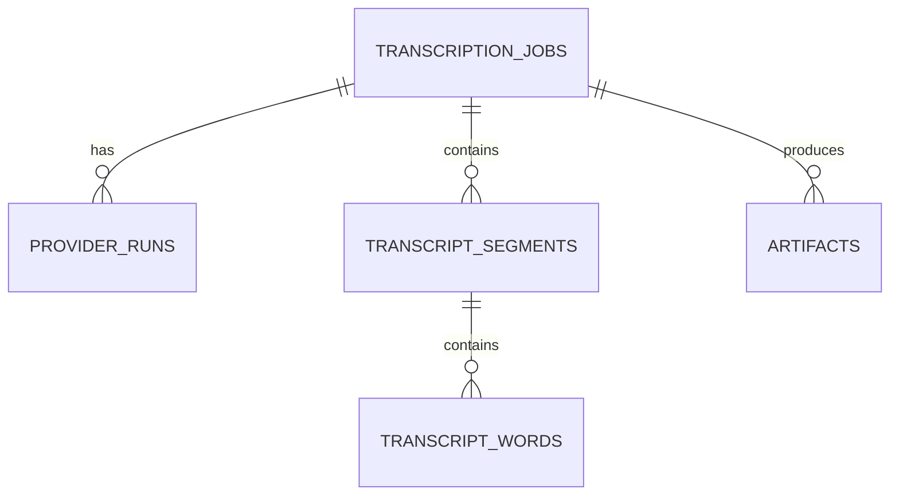

# TranscriptWorkbench Requirements

## Working title

**TranscriptWorkbench** is a local-first, provider-agnostic transcription utility for turning common audio or video files into transcripts, structured transcript data, and later confidence-aware analysis.

## Product goal

Build a small, useful utility that lets a user upload an audio file, choose a transcription provider, request optional capabilities such as timestamps, confidence information, and speaker diarization, then export the result in human-readable and machine-readable formats.

The first implementation should run locally in Streamlit. The design should also support later deployment as a private or bring-your-own-token web app on EC2.

## Design consensus

The app should be built around five agreed-upon decisions:

1. **Use Streamlit first.**  
   Streamlit is the MVP interface because it supports fast local development, file upload, provider selection, checkboxes, tabs, and download buttons with little overhead.

2. **Use SQLite early.**  
   SQLite should persist job metadata, provider runs, segments, words, artifacts, warnings, and errors. This makes later dashboarding possible without requiring Postgres or a cloud database.

3. **Preserve raw provider output always.**  
   Every provider response should be saved unchanged. This protects against parser bugs, provider schema changes, and future reprocessing needs.

4. **Use feature negotiation.**  
   The user can request features like confidence or diarization. The app determines whether the selected provider/model supports those features and explains limitations before transcription.

5. **Treat diarization as first-class, but optional.**  
   The data model should include nullable speaker fields from day one, even before every provider supports speaker labels.

## Target user

The first user is a technical individual who wants to transcribe podcasts, web audio, phone recordings, interviews, lectures, and other audio files for personal research, note-taking, writing, analysis, or later knowledge extraction.

The user is comfortable with Python, local development, `.env` files, and API keys. A later audience may include other users who run the open-source app with their own provider tokens.

## MVP scope

The MVP should include:

- Local Streamlit app
- Audio/video file upload
- OpenAI transcription provider
- Provider/model selection UI
- Feature checkboxes
- Capability feedback panel
- SQLite persistence
- Raw provider response storage
- Result tabs
- TXT export
- Markdown export
- JSON export
- Basic job history foundation

The MVP does **not** need to include AWS, local Whisper, advanced dashboards, summaries, multi-user authentication, batch upload, or real-time transcription.

## Near-term post-MVP scope

The first extension after MVP should add:

- AWS Transcribe provider
- S3 upload
- AWS batch transcription job polling
- Word-level confidence parsing
- Speaker diarization parsing
- Confidence tab with low-confidence section review
- Speaker View tab with labeled speakers

## Later roadmap scope

Later versions may include:

- Local faster-whisper backend
- WhisperX or pyannote-based local diarization
- AssemblyAI backend
- Deepgram backend
- Transcript search
- Transcript library dashboard
- Provider comparison dashboard
- Cost estimation by provider
- LLM-based summaries and outlines
- Entity, topic, and quote extraction
- Export to Obsidian, Notion, or a knowledge graph workflow
- EC2 deployment with Nginx and HTTPS
- Bring-your-own-token mode for deployed use

---

# Functional requirements

## FR-001: Audio file upload

The app shall allow a user to upload a local audio or video file through Streamlit.

Target formats:

- `.mp3`
- `.m4a`
- `.mp4`
- `.mpeg`
- `.mpga`
- `.wav`
- `.webm`
- `.ogg`
- `.flac`

The app should validate the file extension and, where possible, inspect file metadata using `ffprobe`.

## FR-002: File metadata display

After upload, the app shall display basic metadata:

- original filename
- file extension
- file size
- detected MIME type, if available
- estimated duration, if available
- codec, if available
- sample rate, if available
- number of channels, if available

## FR-003: Audio preprocessing

The app shall include an audio preprocessing service, even if the MVP initially passes compatible files directly to the provider.

The preprocessing service should eventually support:

- saving the original upload
- extracting audio from video files
- normalizing audio with `ffmpeg`
- compressing large files when needed
- generating provider-friendly audio
- recording preprocessing warnings and errors

## FR-004: Provider selection

The app shall present a provider dropdown.

MVP provider:

- OpenAI

Near-term providers:

- AWS Transcribe
- Local faster-whisper

Future providers:

- AssemblyAI
- Deepgram
- Google Speech-to-Text
- Azure AI Speech

The provider list shall be registry-driven rather than hardcoded directly into Streamlit UI logic.

## FR-005: Model selection

The app shall present a model dropdown based on the selected provider.

Example OpenAI models:

- `gpt-4o-mini-transcribe`
- `gpt-4o-transcribe`
- `gpt-4o-transcribe-diarize`

The provider registry should define which models belong to each provider and what each model supports.

## FR-006: Requested feature selection

The app shall let the user request optional features:

- Include timestamps
- Include confidence information when available
- Identify speakers when available
- Save raw provider response
- Export TXT
- Export Markdown
- Export JSON

Post-MVP options may include:

- Export SRT
- Export VTT
- Run transcript cleanup
- Generate summary
- Generate topic outline
- Compare providers

## FR-007: Feature negotiation

The app shall compare requested features against selected provider/model capabilities before transcription.

Feature support statuses:

| Status | Meaning |
|---|---|
| `supported` | Directly supported by the selected provider/model |
| `partial` | Supported, but with known limitations |
| `proxy` | Available only as an approximate signal |
| `diagnostic` | Available as model diagnostic information, not calibrated confidence |
| `unsupported` | Not available |
| `not_requested` | User did not request this feature |

Example effective feature object:

```json
{
  "timestamps": "partial",
  "confidence": "proxy",
  "diarization": "unsupported",
  "save_raw": "supported"
}
```

## FR-008: Capability feedback panel

Before running transcription, the app shall display a short capability panel.

Example:

```text
Selected provider: OpenAI
Selected model: gpt-4o-mini-transcribe
Timestamps: partial
Confidence: proxy only
Diarization: unsupported for this model
Raw output preservation: supported
```

## FR-009: Transcription job creation

When the user clicks **Run transcription**, the app shall create a job with:

- unique `job_id`
- created timestamp
- original filename
- file hash
- source file path
- normalized file path, if applicable
- provider
- model
- requested features
- effective features
- status
- warnings
- errors, if any

Job status values:

- `created`
- `preprocessing`
- `queued`
- `running`
- `completed`
- `failed`
- `cancelled`

## FR-010: Provider adapter interface

Every transcription provider shall implement a common adapter interface.

Provider adapters are responsible for:

- validating configuration
- declaring provider/model capabilities
- sending transcription requests
- preserving raw provider output
- parsing provider output into the canonical schema
- returning warnings and errors

The Streamlit UI should not contain provider-specific API details.

## FR-011: OpenAI provider MVP

The MVP shall include an OpenAI provider adapter.

The adapter should support:

- API key from `.env`
- selected OpenAI transcription model
- file submission
- raw response preservation
- text extraction
- canonical transcript result creation
- helpful errors for missing keys, provider failures, unsupported files, and file-size issues

Caveat: OpenAI confidence information should be treated as a proxy when available, not as calibrated word-level confidence.

## FR-012: AWS Transcribe provider

The near-term AWS provider shall support:

- S3 upload
- AWS Transcribe job creation
- job polling
- raw JSON result download
- word-level timestamp parsing
- word-level confidence parsing
- speaker labels when diarization is requested
- canonical segment and word creation
- AWS-specific error handling

AWS Transcribe should be the preferred first backend for true word-level confidence plus diarization.

## FR-013: Local faster-whisper provider

The local provider shall support:

- local model selection
- local transcription
- no API key requirement
- timestamps when available
- segment diagnostics when available
- raw local output preservation
- clear confidence caveats

The first faster-whisper provider does not need to support diarization.

## FR-014: Result tabs

The app shall display results in Streamlit tabs.

Recommended tabs:

1. Transcript
2. Speaker View
3. Confidence
4. Metadata
5. Downloads

The MVP may initially populate only Transcript, Metadata, and Downloads, but the tab structure should already anticipate speaker and confidence outputs.

## FR-015: Transcript tab

The Transcript tab shall show a readable transcript.

If timestamps exist:

```text
[00:01:12 - 00:01:28]
The core issue is not whether AI can answer questions, but whether people know how to frame the problem.
```

If speaker labels exist:

```text
Speaker 1 [00:01:12 - 00:01:28]
The core issue is not whether AI can answer questions, but whether people know how to frame the problem.
```

## FR-016: Speaker View tab

When diarization is available, the Speaker View tab shall show speaker-labeled transcript sections.

If diarization was requested but unavailable, the tab shall explain that the provider/model did not support it.

## FR-017: Confidence tab

When confidence information is available, the Confidence tab shall display:

- confidence type
- average confidence, if available
- low-confidence threshold
- count of low-confidence words or segments
- percentage of low-confidence words or segments
- lowest-confidence sections
- provider caveats

Confidence types:

- `word_confidence`
- `segment_confidence`
- `token_logprob_proxy`
- `segment_diagnostic`
- `none`

## FR-018: Metadata tab

The Metadata tab shall display:

- job ID
- provider
- model
- original filename
- status
- duration
- file size
- requested features
- effective features
- processing time
- warnings
- errors
- output paths

## FR-019: Downloads tab

The Downloads tab shall provide download buttons for generated files.

MVP downloads:

- `.txt`
- `.md`
- `.json`

Future downloads:

- `.srt`
- `.vtt`
- raw provider response
- segments CSV
- words CSV
- confidence report CSV

## FR-020: Local storage layout

The app shall create a local data directory.

Recommended layout:

```text
data/
  transcript_workbench.sqlite
  jobs/
    <job_id>/
      input/
        original.<ext>
        normalized.wav
      raw/
        provider_response.json
      exports/
        transcript.txt
        transcript.md
        transcript.json
        segments.csv
        words.csv
```

## FR-021: SQLite persistence

The app shall use SQLite to persist structured data.

Minimum tables:

- `transcription_jobs`
- `provider_runs`
- `transcript_segments`
- `transcript_words`
- `artifacts`

The app shall initialize the schema automatically at startup.

## FR-022: Raw output preservation

Every provider run shall save raw output when available.

The raw file path shall be stored in SQLite.

If a provider fails before returning a response, the structured error should still be saved.

## FR-023: Error handling

The app shall gracefully handle:

- missing API key
- invalid API key
- unsupported audio format
- file too large
- provider timeout
- provider rate limit
- ffmpeg missing
- transcription failure
- malformed provider response
- SQLite write failure
- export failure

Errors should appear in the UI and be persisted with the job or provider run.

## FR-024: Configuration

The app shall support `.env` configuration.

Recommended variables:

```bash
OPENAI_API_KEY=
AWS_ACCESS_KEY_ID=
AWS_SECRET_ACCESS_KEY=
AWS_DEFAULT_REGION=
AWS_TRANSCRIBE_BUCKET=
ASSEMBLYAI_API_KEY=
DEEPGRAM_API_KEY=
TRANSCRIPT_WORKBENCH_DATA_DIR=./data
MAX_UPLOAD_MB=200
LOW_CONFIDENCE_THRESHOLD=0.80
```

## FR-025: Bring-your-own-token readiness

For local MVP, keys may come from `.env`.

For deployed use, the app should later support session-only provider token entry. User-supplied tokens should not be persisted unless explicitly designed and secured.

## FR-026: Job history foundation

The MVP should include enough SQLite data to support a future job history view.

A basic history view should eventually show:

- date
- filename
- provider
- model
- status
- duration
- feature flags
- output availability

## FR-027: Analysis/dashboard foundation

The schema shall support later analysis of:

- total transcription hours
- jobs by provider
- runtime by provider
- estimated provider cost
- confidence distributions
- low-confidence sections
- diarization usage
- transcript word counts
- failure rates
- common file formats

---

# Canonical data model

## Entity relationship diagram



## TranscriptionJob

```json
{
  "job_id": "uuid",
  "created_at": "2026-04-30T12:00:00Z",
  "completed_at": "2026-04-30T12:02:30Z",
  "status": "completed",
  "original_filename": "sample_audio.m4a",
  "source_type": "uploaded_file",
  "file_hash": "sha256...",
  "duration_seconds": 512.4,
  "provider": "openai",
  "model": "gpt-4o-mini-transcribe",
  "requested_features": {
    "timestamps": true,
    "confidence": true,
    "diarization": false,
    "save_raw": true
  },
  "effective_features": {
    "timestamps": "partial",
    "confidence": "proxy",
    "diarization": "not_requested",
    "save_raw": "supported"
  },
  "warnings": [],
  "outputs": {
    "txt": "data/jobs/<job_id>/exports/transcript.txt",
    "md": "data/jobs/<job_id>/exports/transcript.md",
    "json": "data/jobs/<job_id>/exports/transcript.json",
    "raw": "data/jobs/<job_id>/raw/provider_response.json"
  }
}
```

## TranscriptSegment

```json
{
  "segment_id": "uuid",
  "job_id": "uuid",
  "segment_index": 0,
  "start_seconds": 0.0,
  "end_seconds": 12.4,
  "speaker": "Speaker 1",
  "text": "This is the first segment of the transcript.",
  "confidence": 0.93,
  "confidence_type": "word_confidence",
  "provider_metadata": {}
}
```

## TranscriptWord

```json
{
  "word_id": "uuid",
  "job_id": "uuid",
  "segment_id": "uuid",
  "word_index": 0,
  "start_seconds": 0.0,
  "end_seconds": 0.3,
  "speaker": "Speaker 1",
  "word": "This",
  "confidence": 0.98,
  "confidence_type": "word_confidence",
  "provider_metadata": {}
}
```

---

# Provider capability matrix

| Provider | MVP status | Timestamps | Confidence | Diarization | Role |
|---|---:|---|---|---|---|
| OpenAI | MVP | partial/model-dependent | proxy for selected models | supported only through diarization model | fastest useful MVP |
| AWS Transcribe | near-term | supported | word-level confidence | supported | first serious confidence/diarization backend |
| faster-whisper | near-term | partial/supported | diagnostic | unsupported initially | local/open-source path |
| WhisperX | future | supported | diagnostic | supported with extra setup | local diarization path |
| AssemblyAI | future | supported | supported | supported | managed API alternative |
| Deepgram | future | supported | supported/partial | supported | fast speech API and later streaming path |
| Google Speech-to-Text | future | supported | supported | supported | Google benchmark path |
| Azure AI Speech | future | supported | supported/partial | supported | Azure learning/certification path |

---

# Non-functional requirements

## Modularity

Provider-specific logic must live in provider adapters, not in the Streamlit UI.

## Extensibility

Adding a provider should require:

1. creating a provider adapter
2. adding provider/model metadata to the registry
3. adding parser tests
4. adding provider-specific setup docs

It should not require a major UI rewrite.

## Local-first operation

The MVP must run locally.

## Deployability

The app should later be deployable on EC2 behind Nginx and HTTPS.

## BYOT compatibility

The open-source app should not assume the maintainer’s provider keys. It should support `.env` locally and session-only token entry later.

## Observability

Each job should record:

- requested features
- effective features
- provider/model
- runtime
- status
- warnings
- errors
- artifact paths

## Resilience

A failed transcription should not corrupt the database or delete the original upload.

---

# MVP acceptance criteria

The MVP is accepted when:

1. `streamlit run app.py` launches the app locally.
2. A user can upload `.mp3`, `.m4a`, `.wav`, or `.mp4`.
3. A job-specific directory is created.
4. The original upload is saved.
5. OpenAI transcription runs successfully.
6. Raw provider output is saved.
7. Job metadata is stored in SQLite.
8. Transcript text appears in a results tab.
9. Metadata appears in a metadata tab.
10. TXT, Markdown, and JSON downloads are available.
11. The app shows provider capability warnings before transcription.
12. A missing API key produces a clear UI error.
13. The code structure makes AWS the obvious next provider.

---

# Open questions for later

These do not block MVP:

1. Should deployed users enter API keys in the UI or configure a private deployment with `.env`?
2. Should audio files be deleted automatically after transcription?
3. Should transcript summaries be part of this app or a downstream workflow?
4. Should transcripts be searchable in the app?
5. Should the app support batch upload?
6. Should it ingest podcast URLs directly?
7. Should it include manual transcript correction?
8. Should provider cost estimates be shown in the UI?

---

# Implementation references

Provider APIs change, so check these during implementation:

- OpenAI Speech-to-Text guide: https://developers.openai.com/api/docs/guides/speech-to-text
- OpenAI transcription API reference: https://developers.openai.com/api/reference/resources/audio/subresources/transcriptions/methods/create/
- AWS Transcribe input/output: https://docs.aws.amazon.com/transcribe/latest/dg/how-input.html
- AWS Transcribe overview: https://docs.aws.amazon.com/transcribe/latest/dg/how-it-works.html
- Streamlit file uploader: https://docs.streamlit.io/develop/api-reference/widgets/st.file_uploader
- Python sqlite3: https://docs.python.org/3/library/sqlite3.html
- faster-whisper: https://github.com/SYSTRAN/faster-whisper
- WhisperX: https://github.com/m-bain/whisperX
- AssemblyAI diarization: https://assemblyai.com/docs/pre-recorded-audio/label-speakers
- Deepgram diarization: https://developers.deepgram.com/docs/diarization
