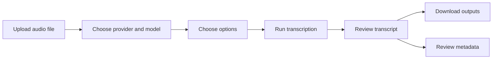

# TranscriptWorkbench User Guide

## What TranscriptWorkbench does

TranscriptWorkbench turns audio files into readable transcripts.

You can use it for:

- podcast episodes
- phone recordings
- interviews
- lectures
- meetings
- voice memos
- web audio
- video files that contain audio

The app is designed to be **local-first** and **bring-your-own-token**. You can run it on your own machine with your own API keys. Later, it can be deployed privately.

The first version focuses on transcription. Later versions can add confidence reports, speaker diarization, local open-source transcription, and transcript analytics.

---

# Quick start

## 1. Install dependencies

From the project folder:

```bash
pip install -r requirements.txt
```

You may also need `ffmpeg`.

On macOS:

```bash
brew install ffmpeg
```

On Ubuntu:

```bash
sudo apt update
sudo apt install ffmpeg
```

On Amazon Linux 2023 (EPEL does not work; use the static binary):

```bash
wget https://johnvansickle.com/ffmpeg/releases/ffmpeg-release-amd64-static.tar.xz
tar -xf ffmpeg-release-amd64-static.tar.xz
sudo cp ffmpeg-*-amd64-static/ffmpeg /usr/local/bin/
sudo cp ffmpeg-*-amd64-static/ffprobe /usr/local/bin/
rm -rf ffmpeg-*-amd64-static* ffmpeg-release-amd64-static.tar.xz
```

## 2. Create your `.env` file

Copy the example file:

```bash
cp .env.example .env
```

Add your OpenAI API key:

```bash
OPENAI_API_KEY=your_openai_key_here
```

## 3. Run the app

```bash
streamlit run app.py
```

The app should open in your browser.

---

# Accessing the deployed app

If TranscriptWorkbench has been deployed to EC2 (see `docs/DEPLOYMENT.md`), you access it
through a browser rather than running it locally.

## URL

- **With custom domain:** `https://your-domain.com`
- **Without custom domain:** `http://<EC2_PUBLIC_IP>:8501`

## Providing your API key

The deployed app uses the `OPENAI_API_KEY` configured on the server. If you are running a
personal deployment and need to override it temporarily, use the **sidebar key override**:

1. Open the sidebar (click **>** in the top-left corner if collapsed)
2. Paste your key into the **"Override key"** field
3. The override is session-only and is never stored on the server

## File uploads on EC2

Large file uploads are governed by the `MAX_UPLOAD_MB` setting in `.env` on the server.
The default on a t2.micro deployment is set to `50 MB` to avoid memory pressure. To raise it,
update `.env` on the server and restart the service:

```bash
sudo systemctl restart transcript-workbench
```

## Transcript data persistence

All jobs, SQLite records, and exported files live in the `data/` directory on the EC2 instance.
They persist across app restarts. They are not backed up automatically — consider periodic
snapshots of the EBS volume or syncing `data/` to S3 if the transcripts matter long-term.

---

# Main workflow



---

# Step-by-step guide

## Step 1: Upload an audio file

Use the file uploader to select an audio or video file.

Supported target formats include:

- MP3
- M4A
- MP4
- MPEG
- MPGA
- WAV
- WEBM
- OGG
- FLAC

After upload, the app may display:

- filename
- file size
- estimated duration
- file type
- audio codec

Screenshot placeholder:

```text
[Upload screen screenshot goes here]
```

## Step 2: Choose a provider

Select a transcription provider.

Early provider options:

| Provider | Best use |
|---|---|
| OpenAI | Easiest default transcription path |
| AWS Transcribe | Better for confidence scores and speaker diarization |
| Local faster-whisper | Local/open-source transcription |

The MVP starts with OpenAI.

Screenshot placeholder:

```text
[Provider selection screenshot goes here]
```

## Step 3: Choose a model

After selecting a provider, choose a model.

Example OpenAI models:

- `gpt-4o-mini-transcribe`
- `gpt-4o-transcribe`
- `gpt-4o-transcribe-diarize`

The available model list depends on the selected provider.

## Step 4: Choose transcription options

Use checkboxes to request optional features.

| Option | Meaning |
|---|---|
| Include timestamps | Try to include timing information |
| Include confidence information | Try to estimate transcript reliability |
| Identify speakers | Try to label who spoke when |
| Save raw provider response | Save the original provider output |
| Export TXT | Create a plain text transcript |
| Export Markdown | Create a readable Markdown transcript |
| Export JSON | Create a structured data export |

Not every provider supports every option. The app shows a capability panel before transcription.

Example:

```text
Selected provider: OpenAI
Selected model: gpt-4o-mini-transcribe
Timestamps: partial
Confidence: proxy
Diarization: unsupported
```

Screenshot placeholder:

```text
[Feature options screenshot goes here]
```

## Step 5: Run transcription

Click **Run transcription**.

The app will:

1. Save your uploaded file.
2. Create a job record.
3. Optionally preprocess the audio.
4. Send the file to the selected provider.
5. Save the raw provider response.
6. Convert the provider response into the app’s standard format.
7. Generate exports.
8. Show results.

## Step 6: Review results

Results are organized into tabs.

Recommended tabs:

- Transcript
- Speaker View
- Confidence
- Metadata
- Downloads

---

# Results tabs

## Transcript tab

This tab shows the readable transcript.

If timestamps are available:

```text
[00:01:12 - 00:01:28]
The core issue is not whether AI can answer questions, but whether people know how to frame the problem.
```

If speaker labels are available:

```text
Speaker 1 [00:01:12 - 00:01:28]
The core issue is not whether AI can answer questions, but whether people know how to frame the problem.
```

## Speaker View tab

Speaker diarization means the app attempts to identify **who spoke when**.

Example:

```text
Speaker 1:
Welcome back. Today we are talking about computational agency.

Speaker 2:
That phrase sounds technical, but the idea is actually practical.
```

Speaker labels are usually generic. The app may say Speaker 1 and Speaker 2 rather than real names.

Diarization works best when:

- speakers have distinct voices
- people do not talk over each other too much
- audio quality is good
- each speaker talks for enough time
- background noise is limited

## Confidence tab

This tab explains how reliable the transcript may be.

Confidence is provider-specific.

| Confidence type | Meaning |
|---|---|
| Word confidence | Provider returned confidence for individual words |
| Segment confidence | Provider returned confidence for transcript chunks |
| Token logprob proxy | Model returned token likelihoods that can flag uncertain text |
| Segment diagnostic | Local model returned quality diagnostics |
| None | No confidence information was available |

A confidence score from AWS and a token probability signal from OpenAI are not the same thing. The app should label the confidence type clearly.

## Metadata tab

This tab shows job details:

- job ID
- filename
- provider
- model
- requested features
- effective features
- creation time
- completion time
- duration
- warnings
- errors
- output paths

## Downloads tab

This tab provides downloadable files.

MVP outputs:

- TXT transcript
- Markdown transcript
- JSON transcript

Later outputs may include:

- SRT captions
- VTT captions
- words CSV
- segments CSV
- confidence report CSV
- raw provider JSON

---

# Choosing the right provider

## Use OpenAI when...

Use OpenAI when you want the easiest high-quality default transcription path.

Good for:

- quick transcripts
- personal workflow
- podcast notes
- general audio
- MVP use

Limitations:

- confidence may be a proxy rather than true word-level confidence
- diarization may require a specific model
- output formats can vary by model

## Use AWS Transcribe when...

Use AWS Transcribe when you want confidence scores and speaker diarization.

Good for:

- word-level confidence
- speaker labels
- structured transcript data
- cloud-native workflow
- using AWS credits
- later dashboarding

Limitations:

- more setup
- requires S3
- jobs are asynchronous
- more cloud plumbing than OpenAI

## Use local faster-whisper when...

Use local faster-whisper when you want a local/open-source option.

Good for:

- privacy
- no per-minute API cost
- offline experimentation
- open-source benchmarking

Limitations:

- local hardware matters
- confidence is diagnostic, not calibrated
- diarization requires additional tooling

---

# What confidence means

Confidence is a signal about transcription reliability. It helps you know what parts may need review.

Simple interpretation:

| Display label | How to read it |
|---|---|
| High confidence | Probably reliable |
| Medium confidence | Worth checking if the section matters |
| Low confidence | Listen to the audio if accuracy matters |

Low confidence is especially useful for:

- noisy recordings
- overlapping speakers
- uncommon names
- technical vocabulary
- music or background sound
- poor microphones
- phone audio

---

# What speaker diarization means

Speaker diarization means “who spoke when.”

It does not necessarily identify a real person by name. It usually creates generic labels:

- Speaker 1
- Speaker 2
- Speaker 3

Diarization can be imperfect. It may split one person into multiple speakers or merge two similar voices. Treat it as a helpful starting point.

---

# Output files

Each transcription job gets its own folder.

Example:

```text
data/jobs/<job_id>/
  input/
    original.m4a
  raw/
    provider_response.json
  exports/
    transcript.txt
    transcript.md
    transcript.json
```

## TXT output

Best for:

- simple reading
- copying into another document
- quick notes

## Markdown output

Best for:

- Obsidian
- GitHub
- documentation
- blog drafting
- structured notes

## JSON output

Best for:

- analysis
- dashboards
- model comparison
- knowledge graph workflows
- future reprocessing

## Raw provider response

Best for:

- debugging
- re-parsing
- provider comparison
- improving the app

Most users will not read this file, but it is valuable for development.

---

# Job history

Later versions of the app will show job history.

This will help you:

- reopen previous transcripts
- compare providers
- track transcription hours
- inspect failed jobs
- review confidence trends
- build a transcript library

---

# Common problems

## The app says my API key is missing

Check `.env`.

Make sure it contains:

```bash
OPENAI_API_KEY=your_key_here
```

Restart Streamlit after editing `.env`.

## The app cannot read my audio file

Possible causes:

- unsupported format
- corrupted file
- missing `ffmpeg`
- file too large
- unusual audio encoding

Try converting the file to `.mp3` or `.wav`.

## The transcript has no timestamps

The selected provider/model may not support timestamps in the requested output format.

Try another provider or model.

## The transcript has no speaker labels

The selected provider/model may not support speaker diarization.

Try a diarization-capable model or AWS Transcribe when available.

## Confidence is missing

The selected provider/model may not return confidence information.

For true word-level confidence, use AWS Transcribe when available.

## The app is slow

Speed depends on:

- audio length
- provider
- model
- internet connection
- local hardware
- preprocessing

Local open-source models may be slower on CPU-only machines.

## Upload fails

The file may exceed Streamlit’s upload limit. Compress the audio or increase Streamlit’s configured upload size.

---

# Suggested personal workflow

For everyday use:

1. Start with OpenAI default transcription.
2. Use Markdown export for reading and note-taking.
3. Use JSON export when you want to analyze the transcript later.
4. Use AWS Transcribe when speaker labels or confidence scores matter.
5. Use local faster-whisper when privacy or open-source experimentation matters.

---

# Future features

Possible future additions:

- AWS Transcribe provider
- local faster-whisper provider
- WhisperX diarization
- AssemblyAI provider
- Deepgram provider
- transcript search
- transcript library dashboard
- provider comparison mode
- confidence visualization
- batch uploads
- podcast URL ingestion
- LLM summaries
- quote extraction
- entity extraction
- Obsidian or Notion export
- EC2 deployment guide

---

# Glossary

## ASR

Automatic Speech Recognition. The general technology category for turning speech into text.

## Transcription

The process of converting spoken audio into written text.

## Diarization

The process of identifying which speaker spoke at which time.

## Timestamp

A marker showing when a word or segment occurred in the audio.

## Confidence

A provider-specific signal related to transcription reliability.

## Provider

The transcription engine or service, such as OpenAI, AWS Transcribe, or faster-whisper.

## Model

The specific speech-to-text model used by a provider.

## Raw provider response

The original response returned by the transcription provider before the app converts it into a standard format.

## Canonical schema

The app’s standard internal representation of jobs, transcript segments, words, speakers, confidence, and outputs.

---

# Screenshot placeholders

Add screenshots as the UI stabilizes.

Suggested files:

```text
images/01-upload-file.png
images/02-provider-selection.png
images/03-feature-options.png
images/04-capability-panel.png
images/05-processing-status.png
images/06-transcript-tab.png
images/07-confidence-tab.png
images/08-downloads-tab.png
```

Example screenshot caption:

```markdown


Use this screen to upload a local audio or video file. After upload, the app displays file metadata and prepares the file for transcription.
```
